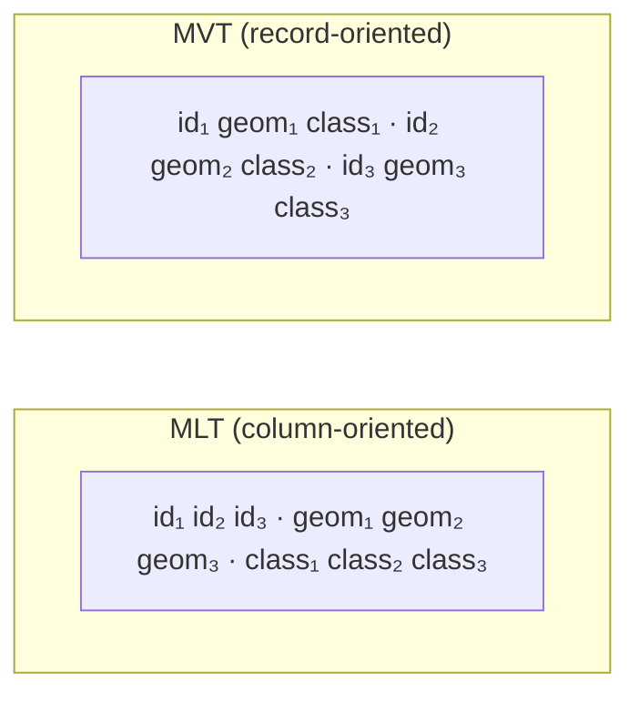

<h1>Overview</h1>

--8<-- "live-spec-note"

[TOC]

---

This page describes the MLT data model.
The byte layout is in the [v1 specification](specification/v1.md) and the [v2 specification](specification/v2.md).

# Tiles

MLT is a tiled format.
A dataset is cut into a pyramid of square tiles, one per `z/x/y` address.
A client fetches the tiles covering the current viewport at the current zoom.
Each tile is self-contained: nothing outside it is needed to decode it.

This is the same tiling model MVT uses.
Tiles are commonly stored in [PMTiles](https://github.com/protomaps/PMTiles) or MBTiles archives and served over HTTP, for example by the [Martin tile server](https://maplibre.org/martin/).

# Extents

Coordinates inside a tile are not longitude and latitude.
Each tile declares an `extent`, and geometry coordinates are signed integers on the `0..=extent` grid, relative to the tile's own corner.
The client maps the grid onto the screen using the tile's `z/x/y` address.

Integer coordinates compress well, since neighbouring vertices differ by small numbers.

`4096` is the conventional extent and the encoder default.
A larger extent gives more precision and costs more bytes.

Coordinates MAY be negative or exceed `extent`.
This lets geometry crossing a tile boundary keep its shape, so that lines and polygon edges meet across the seam instead of being clipped to it.

# Layers and features

A tile is a sequence of layers, called `FeatureTable`s in the specification.
A layer is a thematic group of data such as `water`, `roads` or `place_labels`, and is the unit a [MapLibre Style](https://maplibre.org/maplibre-style-spec/) targets.
Layers are equivalent to layers in MVT.

Each layer holds up to `2^31 - 1` features, so that a feature count fits a signed 32-bit integer.

A feature has:

- a geometry, typed by the OGC Simple Feature Access model, excluding `GeometryCollection`
- an optional id
- any number of properties

Features in one layer share a single set of property columns and normally share one geometry type.
Mixing geometry types in a layer is allowed, but one type per layer compresses better.

!!! NOTE
    The terms `column`, `field`, and `property` are used interchangeably in the specification.

# Columns, not records

MVT is record-oriented: it writes feature 1 whole, then feature 2 whole, each with its own tags and geometry commands.
MLT is column-oriented: it writes every feature's `id`, then every feature's geometry, then every feature's `class`, and so on.

The column layout has the following consequences:

- **Compression.** A column of road classes is a few distinct strings repeated many times, which a dictionary collapses. A column of ascending ids is a constant delta. Neither pattern is visible when the values are spread across records.
- **Decoding speed.** A column decodes with one loop over one buffer, which vectorizes. A record stream decodes with a branchy loop over mixed types.
- **GPU upload.** Vertices are already contiguous, so they can be copied to a GPU buffer without gathering.
- **Partial decoding.** A renderer that needs only the geometry and one property can skip the other columns.

# Streams

A column is split into several streams, each a contiguous run of same-typed values.
This follows the [ORC](https://orc.apache.org/specification/ORCv1/) file format.
Each stream carries its own metadata: value count, byte length and encoding.

A nullable string column, for example, becomes:

- a present stream, one bit per feature, saying which features have a value
- a length stream, the byte length of each string
- a data stream, the UTF-8 bytes

MLT defines these stream kinds:

| Stream | Holds |
|---|---|
| **Present** | One bit per feature: does this feature have a value? Omitted for a column that cannot be null. |
| **Data** | The values themselves: booleans, integers, floats, strings, dictionary codes, or vertex coordinates. |
| **Length** | Element counts for variable-sized values: string byte lengths, ring vertex counts, list sizes. |
| **Offset** | Indices into another stream, used by dictionary encodings. |

Each stream is encoded independently.
Lengths are usually small and repetitive and run-length encode well.
String bytes do not, but often dictionary-encode well.

# Encodings

Every stream has its own lightweight encoding: delta, run-length, dictionary, bit packing, FSST, and others.
Lightweight means cheap enough to decode at render time.

Encodings cascade.
Dictionary encoding turns a string column into a stream of integer codes, and that integer stream is then delta- or bit-packed like any other.

Encoders choose encodings by sampling, since trying every combination is too expensive.
The [encoding algorithms](encodings.md) page describes each scheme.
The specifications say which streams may use which.

Tiles are usually also gzip- or brotli-compressed in transit.

# Sorting

Feature order is the encoder's choice.
Sorting a layer by a low-cardinality property groups equal values into runs that RLE collapses.
Sorting by spatial locality shortens vertex deltas.

MLT does not fix an order.
Encoders MAY reorder features.
Applications that depend on source order must disable sorting or carry an explicit ordering property.

# MVT compatibility

MLT can represent the same common vector tile content as MVT, but it is not a byte-for-byte or schema-free replacement.
The differences come from MVT's per-feature tag/value model versus MLT's per-layer column model:

- **Property types are fixed per layer.**
  In MVT, the same key can technically reference values of different data types on different features in a layer.
  In MLT, one property name corresponds to one column, and that column has one declared type for the whole layer.
  MVT data with mixed types must therefore be normalized before or during conversion, for example by lossless numeric widening, coercing values to strings, dropping mismatched values, or rejecting the tile.
- **Missing properties become typed nulls.**
  MVT normally represents a missing property by omitting the key/value tag from that feature; the MVT value union has no dedicated null type.
  MLT represents the union of layer properties as columns, so a feature that lacks a property stores a null in that column and the column is marked nullable.
  When converting MLT back to MVT, null property values should be omitted from the feature tags.
- **A feature has at most one value per property column.**
  MVT tag streams can encode the same key more than once for a single feature, even though most MVT APIs expose properties as a map and collapse such duplicates.
  MLT has one cell per feature per column, so duplicate keys on one feature must be rejected, collapsed deterministically, or renamed before encoding.
- **Feature order is not necessarily a stable round-trip property.**
  MVT stores features in wire order.
  MLT encoders may preserve order, but they may also sort features by id or spatial locality to improve compression when that optimization is enabled.
- **Layer names must be non-empty.**
  The MVT protobuf schema marks the layer `name` field as required, but some Mapbox-authored tooling validates that it is present as well as non-empty.
  The written MVT specification does not explicitly say that the required name cannot be an empty string.
  MLT treats that omission as an oversight: an empty layer name is invalid and must be rejected.

# Format versions

Every layer in a tile is prefixed with a one-byte tag naming the format of its body.
A decoder skips a layer whose tag it does not know.
Versions can therefore be mixed in one tile, and a new version does not break old readers.

| Tag | Version | Status |
|---|---|---|
| `0x01` | [MLT v1](specification/v1.md) | Stable. Implemented by every shipped encoder and decoder. |
| `0x02` | [MLT v2](specification/v2.md) |  Under development. The wire format may change without notice. |

v2 uses the v1 data model described above and changes only the byte layout.

# In-memory format

The record-oriented, array-of-structures in-memory model used by libraries processing Mapbox Vector Tiles incurs considerable overhead.
This includes creating many small objects (increasing memory allocation load) and placing additional strain on garbage collectors in browsers.

MLT uses a columnar memory layout (data-oriented design) for its in-memory format to overcome these issues.
This approach improves cache utilization for subsequent data access and enables the use of fast SIMD instructions.
The MLT in-memory format incorporates ideas from analytical in-memory formats like Apache Arrow, Velox, and the DuckDB execution format, tailored for visualization use cases.
It is also designed for future parallel processing on the GPU within compute shaders.

The main design goals are:

- Define a platform-agnostic representation to avoid expensive materialization costs, especially for strings.
- Maximize CPU throughput by optimizing memory layout for cache locality and SIMD instructions.
- Allow random (preferably constant-time) access to all data for parallel processing on GPUs (compute shaders).
- Provide compressed data structures that can be processed directly without full decoding.
- Provide tile geometries in a representation that can be loaded into GPU buffers with minimal additional processing.

Data is stored in contiguous memory buffers called **vectors**, accompanied by metadata and an optional null bitmap.
An auxiliary offset buffer enables random access to variable-sized data types like strings or lists.
The supported vector types are:

- [Flat Vectors](https://duckdb.org/internals/vector.html#flat-vectors)
- [Constant Vectors](https://duckdb.org/internals/vector.html#constant-vectors)
- [Sequence Vectors](https://duckdb.org/internals/vector.html#sequence-vectors)
- [Dictionary Vectors](https://duckdb.org/internals/vector.html#dictionary-vectors)
- FSST Dictionary Vectors
- Shared Dictionary Vectors
- [Run-End Encoded (REE) Vectors](https://arrow.apache.org/docs/format/Columnar.html#run-end-encoded-layout)

Using a compressed vector where possible makes the conversion from storage to in-memory format essentially a zero-copy operation.

Following Apache Arrow's approach and the [Intel performance guide](https://www.intel.com/content/www/us/en/developer/topic-technology/data-center/overview.html), decoders should allocate memory on addresses aligned to a 64-byte multiple (where possible).

!!! NOTE
    Further evaluation is needed to determine if [recent research](https://arxiv.org/pdf/2306.15374.pdf) can enable random access on delta-encoded values.
