<h1>MapLibre Tile Specification</h1>

--8<-- "live-spec-note"

[TOC]

---

# Basics

An MLT (MapLibre Tile) contains information about a specific geographic region, known as a tile.
Each tile is a collection of `FeatureTables`, which are equivalent to `Layers` in the [MVT specification](https://github.com/mapbox/vector-tile-spec).

A `FeatureTable` contains thematically grouped vector data, known as `Features`.
A `FeatureTable` can contain up to `2^31 - 1` (2,147,483,647) features; this limit is chosen so the feature count fits in signed 32-bit integer fields used by decoders.

Features within a single FeatureTable share a common set of attribute columns (properties) and typically share the same geometry type (though this is not strictly required).

Each `FeatureTable` is preceded by a `FeatureTableMetadata` that describes `FeatureTable`'s structure.

The visual appearance of a tile is usually defined by a [MapLibre Style](https://maplibre.org/maplibre-style-spec/), which specifies how features are rendered.

Each feature must have

- a `geometry` column (type based on the OGC's Simple Feature Access Model (SFA), excluding support for `GeometryCollection` types)
- an optional `id` column
- optional property columns

While geometries are not restricted to a single type, using one type per table is recommended for efficiency.
As in MVT, geometry coordinates are encoded as integers within vector tile grid coordinates.

!!! NOTE
    The terms `column`, `field`, and `property` are used interchangeably in this document.

# MVT Compatibility Notes

MLTv1 is inspired by MVT and can represent the same common vector tile content, but it is not a byte-for-byte or schema-free replacement.
The main differences come from MVT's per-feature tag/value model versus MLT's per-layer column model:

- **Property types are fixed per FeatureTable.**
  In MVT, the same key can technically reference values of different data types on different features in a layer.
  In MLT, one property name corresponds to one column, and that column has one declared type for the whole layer (`FeatureTable`).
  MVT data with mixed types must therefore be normalized before or during conversion, for example by lossless numeric widening, coercing values to strings, dropping mismatched values, or rejecting the tile.
- **Missing properties become typed nulls.**
  MVT normally represents a missing property by omitting the key/value tag from that feature; the MVT value union has no dedicated null type.
  MLT represents the union of layer properties as columns, so a feature that lacks a property stores a null in that column and the column is marked nullable.
  When converting MLT back to MVT, null property values should be omitted from the feature tags.
- **A feature has at most one value per property column.**
  MVT tag streams can encode the same key more than once for a single feature, even though most MVT APIs expose properties as a map and collapse such duplicates.
  MLT has one cell per feature per column, so duplicate keys on one feature must be rejected, collapsed deterministically, or renamed before encoding.
- **Feature order is not necessarily a stable round-trip property.**
  MVT stores features in wire order.
  MLT encoders may preserve order, but they may also sort features by id or spatial locality to improve compression when that optimization is enabled.
  Applications that rely on source feature order should disable feature sorting or carry an explicit ordering property.
- **Layer names must be non-empty.**
  The MVT protobuf schema marks the layer `name` field as required, but some Mapbox-authored tooling validates that it is present as well as non-empty.
  The written MVT specification does not explicitly say that the required name cannot be an empty string.
  MLT treats that omission as an oversight: an empty layer name is invalid and must be rejected.

# Tile Layout

A `FeatureTable` in the MLT specification uses a tabular, column-oriented layout.
It employs various lightweight compression schemes to encode column values efficiently.

A FeatureTable consists of a mandatory `geometry` column, an optional `id` column, and optional property columns.
The absence of a single header at the beginning of the tile allows `FeatureTable`s to be constructed independently, and even concatenated on the fly.

A logical column is separated into several physical `streams` (sub-columns), inspired by the ORC file format.
These streams are stored contiguously.
A stream is a sequence of values of a known length in a continuous memory chunk, all sharing the same type.
Streams include additional metadata, such as their size and encoding type.

For example, a nullable string property column might have:

- A **`present` stream** (a bit flag indicating the presence of a value).
- A **`length` stream** (describing the number of characters for each string).
- A **`data` stream** (containing the actual UTF-8 encoded string values).

MLT defines the following stream types:

- **Present**:
  Enables efficient encoding of sparse columns by indicating value presence via a bit flag.
  This stream can be omitted if the column is not nullable (as declared in the `FieldMetadata`).
- **Data**:
  Stores the actual column data (e.g., `boolean`, `int`, `float`, or `string` values for feature properties, dictionary-encoded values, or geometry coordinates).
  For fixed-size data types (`boolean`, `int`, `float`), this is the only required stream besides the optional `present` stream.
- **Length**:
  Specifies the number of elements for variable-sized data types like strings or lists.
- **Offset**:
  Stores offsets into a data stream when using dictionary encoding (e.g., for strings or vertices).

These physical streams are further categorized into logical streams that define how to interpret the data:

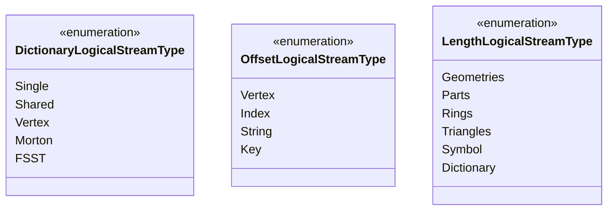

## Metadata

### Tileset Metadata <span class="experimental"></span>

!!! NOTE
    Tileset metadata was initially implemented as a size reduction experiment.
    This feature is not currently supported.

Global metadata for the entire tileset is stored separately in a [JSON file](assets/spec/mlt_tileset_metadata.json).

This tileset metadata provides information for the full tileset and is the equivalent of the TileJSON spec commonly used with MVT and other tile types.
By defining this information once per tileset, we avoid redundant metadata in each tile, saving significant space, especially for small tiles.

### Tile Metadata
There is no global tile header.  Each `FeatureTable` has its own metadata.

### FeatureTable Metadata

The `FeatureTableMetadata` is described in detail below.

Within a `FeatureTable`, additional metadata describes the structure of each part:

- **FieldMetadata**:
  Contains information about a field (column), including the number of streams it comprises and its vector type for efficient decoding into the in-memory format.
  Every field section is preceded by a `FieldMetadata` section.
- **StreamMetadata**:
  Contains information about a stream, such as the encoding scheme used and the number of values.
  Every stream section is preceded by a `StreamMetadata` section.

Since every `Field` has a `FieldMetadata` section, even for fields absent in a specific tile, no `id` is needed.
A field's absence is indicated by a zero value for its number of streams.
All integers in metadata sections are `Varint`-encoded (for u32) or bit-packed (for u8).

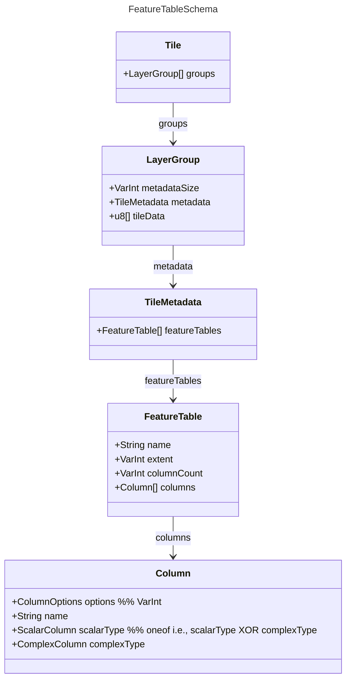

The required `extent` field defines the coordinate space size for the tile's geometry.
Geometry coordinates in MapLibre Tiles are encoded as signed integers in vector-tile grid coordinates (typically near the `0..=extent` range, but not restricted to it).
Values MAY be negative or exceed extent for geometry that crosses tile boundaries.
Encoders MAY default to `4096` when a user does not specify the extent.
Decoders MUST require it to diferente `extent` and `columnCount`.

Strings are encoded as UTF-8 sequences of characters with a length header:

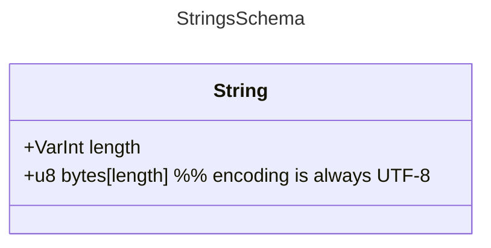

Columns can be thought of as a union of scalar and complex columns and can have these options:

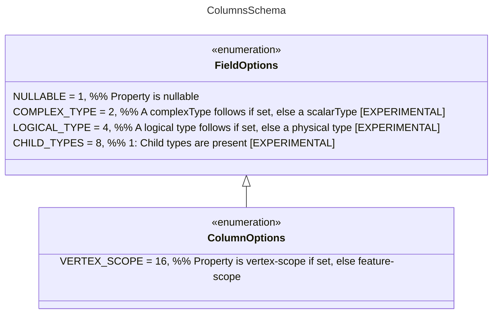

Scalar columns are laid out as follows:

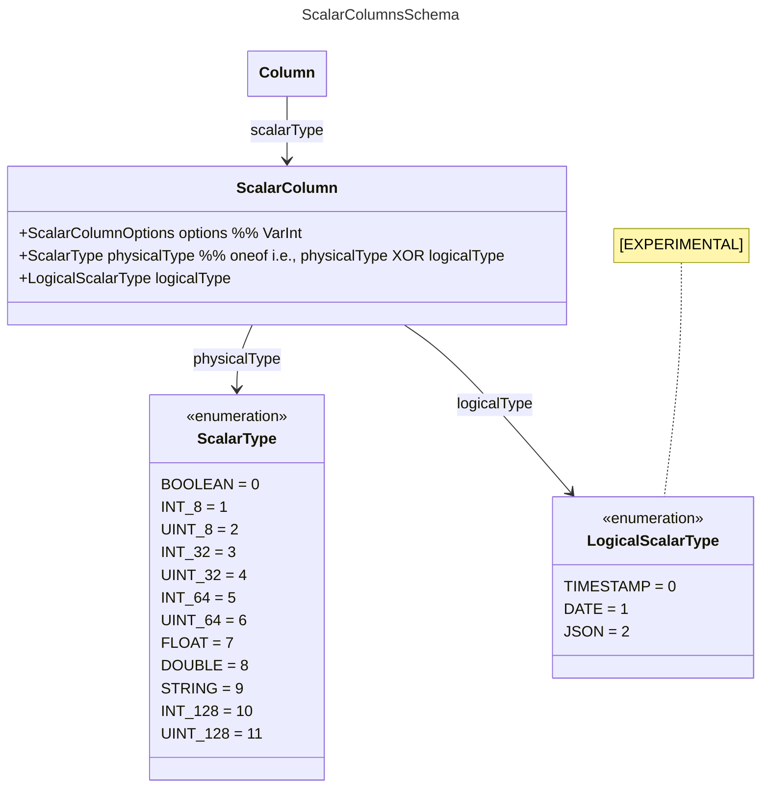

And `ComplexColumns` like this:

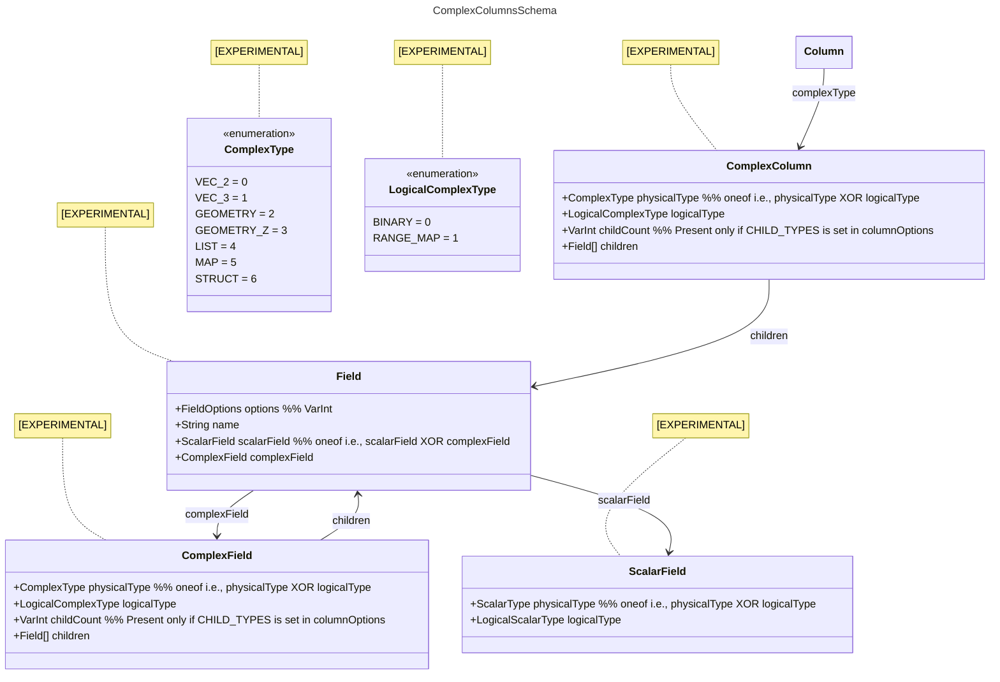

## Type System

The MLT type system distinguishes between physical and logical types.
Physical types define the data layout in storage, while logical types add semantic meaning.
This separation simplifies encoder and decoder implementation and allows encoding schemes to be reused.

### Physical Types

Physical types define the data layout in storage.
Both scalar and complex types can be categorized as fixed-size or variable-size binaries.
Variable-size binaries require an additional length stream to specify the size of each element.
Fixed-size binaries have a consistent bit (boolean) or byte width and thus require no length stream.

**Scalar Types**

Each scalar type uses a specific encoding scheme for its data stream.

| Data Type                         | Logical Types               | Description                    | Layout      |
|-------------------------------------------|---------------------------------|--------------------------------------|---------------|
| Boolean                           |                         |                              | Fixed-Size    |
| Int8, UInt8, Int32, UInt32, Int64, UInt64 | Date (int32), Timestamp (int64) |                              | Fixed-Size    |
| Float, Double                       |                         |                              | Fixed-Size    |
| String                            | JSON                      | UTF-8 encoded sequence of characters | Variable-Size |

**Complex Types <span class="experimental"></span>**

Complex types are composed of scalar types.

| Data Type      | Logical Types      | Description                              | Layout      |
|------------------|----------------------|----------------------------------------------------|---------------|
| List           | Binary (List<UInt8>) |                                        | Variable-Size |
| Map            | Map<vec2d, T>      | Additional key stream -> length, key, data streams | Variable-Size |
| Struct         |                  |                                        |             |
| Vec2<T>, Vec3<T> | Geometry, GeometryZ  |                                        | Fixed-Size    |

### Logical Types <span class="experimental"></span>

!!! CAUTION
    Original text had `encodings can be reused` text which is unclear.
    What is "encodings" in this context?

Logical types add semantics on top of physical types, enabling code reuse and simplifying encoder/decoder implementation.

| Logical Type | Physical Type      | Description                        |
|--------------|----------------------|--------------------------------------------|
| Date       | Int32            | Number of days since Unix epoch          |
| Timestamp    | Int64            | Number of milliseconds since Unix epoch    |
| RangeMap     | Map<vec2<Double>, T> | For storing linear referencing information |
| Binary       | List<UInt8>        |                                  |
| JSON       | String             |                                  |
| Geometry     | vec2<Int32>        |                                  |
| GeometryZ    | vec3<Int32>        |                                  |

### Nested Fields Encoding <span class="experimental"></span>

This property type is analogous to JSON in that it contains key-value maps and lists which can
be nested.  Property keys are always strings.

The encoding consists of:
- A length stream
- Dictionary streams
- A presence stream
- A data stream

The length stream indicates how many data values are written for each feature.
This is the only stream which is always written.

A dictionary stream is emitted for each unique data type present, containing all the values of
that type.  Values are referenced by their index within the combined set of these dictionaries.

A presence stream is emitted if the property is null for any feature.  This distinguishes between
empty (`{}`) and a null value when the length is zero.

The data stream encodes the index of values within the dictionary set along with control values
describing the structure of the data.  Maps and lists are encoded with a control value and the
number of values to follow which are within that collection.

Sharing the dictionaries by grouping columns is not yet supported.

### RangeMap <span class="experimental"></span>

`RangeMaps` efficiently encode linear referencing information, as used in [Overture Maps](https://docs.overturemaps.org/overview/feature-model/scoping-rules#geometric-scoping-linear-referencing).
`RangeSets` store range values and data values in two separate streams. The min and max values for the ranges are stored as interleaved double values in a separate range stream.

## Encoding Schemes

MLT uses various lightweight compression schemes for space-efficient storage and fast decoding.
Encodings can be recursively cascaded (hybrid encodings) to a certain degree.
For example, integer columns resulting from dictionary encoding can be further compressed using integer encoding schemes.

The following encoding pool was selected based on analysis of compression ratio and decoding speed on test datasets like OpenMapTiles and Bing Maps tilesets.

| Data Type | Logical Level Technique      | Physical Level Technique          | Description |
| --------- | ---------------------------- | ----------------------------------- | ----------- |
| Boolean   | [Boolean RLE](https://orc.apache.org/specification/ORCv1/#boolean-run-length-encoding) | | |
| Integer   | Plain, RLE, Delta, Delta-RLE | [SIMD-FastPFOR](https://arxiv.org/pdf/1209.2137.pdf), [Varint](https://protobuf.dev/programming-guides/encoding/#varints) | |
| Float     | Plain, RLE, Dictionary | | |
| String    | Plain, Dictionary, [FSST](https://www.vldb.org/pvldb/vol13/p2649-boncz.pdf) Dictionary | | |
| Geometry  | Plain, Dictionary, Morton-Dictionary | | |

!!! NOTE
    `FSST`, and `FastPFOR` encodings are <span class="experimental"></span>.

SIMD-FastPFOR is generally preferred over Varint encoding due to its smaller output and faster decoding speed.
Varint encoding is included mainly for compatibility and simplicity, and it can be more efficient when combined with heavyweight compression like GZip.

A brute-force search for the best encoding scheme is too costly.
Instead, we recommend the selection strategy from the [BTRBlocks](https://www.cs.cit.tum.de/fileadmin/w00cfj/dis/papers/btrblocks.pdf) paper:

- Calculate data metrics to exclude unsuitable encodings early (e.g., exclude RLE if the average run length is less than 2).
- Use a sampling-based algorithm: randomly select parts of the data totaling ~1% of the full dataset and apply the candidate encodings from step 1.
  Choose the scheme that produces the smallest output.

## FeatureTable Layout

### ID Column

An `id` column is not mandatory.
If included, it should be a u64 or narrower integer type (u32 if possible) for MVT compatibility.
A narrower type enables the use of efficient encodings like FastPfor128.

### Geometry Column {#geometry-column}

The geometry column uses a Structure of Arrays (SoA) layout (data-oriented design).
The `x`, `y`, and optional `z` coordinates are stored interleaved in a `VertexBuffer` for efficient CPU processing and direct copying to GPU buffers.
If the `z` coordinate is not needed for rendering, it can be stored separately as an `M-value` (see vertex-scoped properties).

The geometry information is separated into different streams, partly inspired by the [geoarrow](https://github.com/geoarrow/geoarrow) specification.
This separation enables better compression optimization and faster processing.
Pre-tessellated polygon meshes can also be stored directly to avoid runtime triangulation.

A geometry column can consist of the following streams:

| Stream Name    | Data Type | Encoding         | Mandatory |
| -------------- | :-------: | ------------------ | :-------: |
| GeometryType  |   Byte    | Integer |     ✓     |
| NumGeometries |   UInt32  | Integer |         |
| NumParts      |   UInt32  | Integer |         |
| NumRings      |   UInt32  | Integer |         |
| NumTriangles  |   UInt32  | Integer |         |
| IndexBuffer   |   UInt32  | Integer |         |
| VertexOffsets |   UInt32  | Integer |         |
| VertexBuffer  | Int32 or Vertex[] | Plain, Dictionary, Morton |     ✓     |

Depending on the geometry type, the following streams are used in addition to `GeometryType`:
- **Point**: VertexBuffer
- **LineString**: NumParts, VertexBuffer
- **Polygon**: NumParts (Polygon), NumRings (LinearRing), VertexBuffer
- **MultiPoint**: NumGeometries, VertexBuffer
- **MultiLineString**: NumGeometries, NumParts (LineString), VertexBuffer
- **MultiPolygon**: NumGeometries, NumParts (Polygon), NumRings (LinearRing), VertexBuffer

When LineString and Polygon types are mixed in the same column, LineString vertex counts are stored in the NumRings stream (see [Length Stream Encoding Rules](#length-stream-encoding-rules) below).

An additional `VertexOffsets` stream is present when using Dictionary or Morton-Dictionary encoding.
If geometries (mainly polygons) are pre-tessellated for direct GPU use, `NumTriangles` and `IndexBuffer` streams must be provided.

The remainder of this section describes the binary format and decoding rules in detail.
The format is designed for efficient storage and GPU-friendly random access patterns.

#### Geometry Types

Six geometry types are supported, encoded as unsigned integers:

| Value | Type            | Description                                       |
|-------|-----------------|---------------------------------------------------|
| 0     | Point           | Single coordinate                                 |
| 1     | LineString      | Sequence of coordinates forming a line            |
| 2     | Polygon         | Closed rings (exterior + optional interior holes) |
| 3     | MultiPoint      | Collection of points                              |
| 4     | MultiLineString | Collection of line strings                        |
| 5     | MultiPolygon    | Collection of polygons                            |

#### Binary Structure

A geometry column is stored as a sequence of streams, prefixed by a stream count:

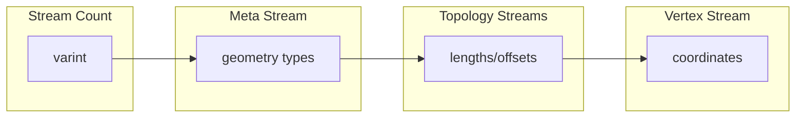

Each stream contains:

1. **Stream metadata** - encoding parameters (physical type, logical type, codec, value count, byte length)
2. **Encoded data** - the actual values

##### Stream Types

The streams listed above map to the following physical and logical stream types:

| Physical Type | Logical Type | Specification Name | Content                                                   |
|---------------|--------------|--------------------|-----------------------------------------------------------|
| `DATA`        | `NONE`       | GeometryType       | Geometry type per feature (see [Geometry Types](#geometry-types)) |
| `LENGTH`      | `GEOMETRIES` | NumGeometries      | Number of sub-geometries in Multi* types                  |
| `LENGTH`      | `PARTS`      | NumParts           | Number of rings per polygon or lines per multi-linestring |
| `LENGTH`      | `RINGS`      | NumRings           | Number of vertices per ring or per linestring segment     |
| `LENGTH`      | `TRIANGLES`  | NumTriangles       | Number of triangles per polygon (tessellated)             |
| `OFFSET`      | `INDEX`      | IndexBuffer        | Triangle vertex indices (tessellated)                     |
| `OFFSET`      | `VERTEX`     | VertexOffsets      | Indices into vertex dictionary                            |
| `DATA`        | `VERTEX`     | VertexBuffer       | Vertex coordinates (x, y pairs)                           |
| `DATA`        | `MORTON`     | VertexBuffer       | Morton-encoded vertex coordinates                         |

#### Topology Encoding

MLT uses a **length-based** encoding for geometry topology rather than explicit drawing commands. This enables efficient random access to individual features.

##### Conceptual Hierarchy

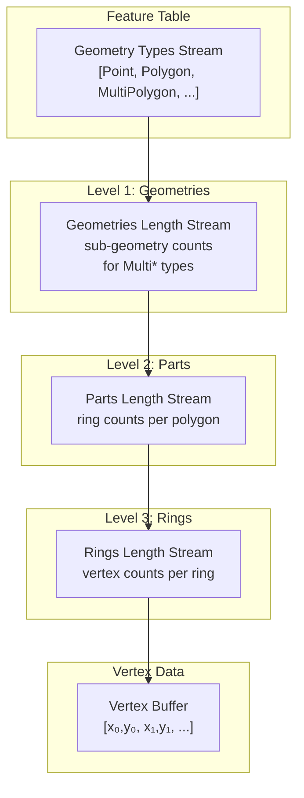

##### Which Streams Are Present

The streams included depend on the geometry types in the column:

| Geometry Type   | Geometries | Parts | Rings |
|-----------------|:----------:|:-----:|:-----:|
| Point           |     -      |   -   |   -   |
| MultiPoint      |     ✓      |   -   |   -   |
| LineString      |     -      |  ✓*   |   -   |
| MultiLineString |     ✓      |  ✓*   |   -   |
| Polygon         |     -      |   ✓   |   ✓   |
| MultiPolygon    |     ✓      |   ✓   |   ✓   |

*LineString parts are stored in the Rings stream when Polygons are also present in the same column.

##### Length Stream Encoding Rules

Length values are stored only for geometry types that need them. The key insight is that **simple types have an implicit count of 1**, while **Multi\* types store their sub-geometry counts explicitly**.

The encoding uses a **type threshold** to determine which geometries need explicit lengths:

| Stream            | Threshold | Types Needing Explicit Length  |
|-------------------|-----------|-------------------------------|
| `geometry_offsets`                    | Polygon    | MultiPoint, MultiLineString, MultiPolygon          |
| `part_offsets` (Rings stream present) | LineString | Polygon, MultiPoint, MultiLineString, MultiPolygon |
| `part_offsets` (no Rings stream)      | Point      | LineString                                         |

**Rule**: If a geometry type's value is greater than the threshold type's value (see [Geometry Types](#geometry-types) table), store its length explicitly. Otherwise, the length is implicitly 1.

**Example**: A column with `[Point, MultiPolygon, Polygon]` geometry types:

```
Encoded geometries lengths: [3]     // Only MultiPolygon needs explicit count
                                    // (MultiPolygon=5 > Polygon=2)

Decoding to offsets:
  Point:        implicit 1  → offset 0→1   (Point=0, not greater than Polygon=2)
  MultiPolygon: explicit 3  → offset 1→4   (MultiPolygon=5 > Polygon=2, read from stream)
  Polygon:      implicit 1  → offset 4→5   (Polygon=2, not greater than Polygon=2)

Result: geometry_offsets = [0, 1, 4, 5]
```

#### Vertex Encoding

##### Componentwise Delta Encoding

Vertices are stored as interleaved (x, y) coordinate pairs using **componentwise delta encoding**:

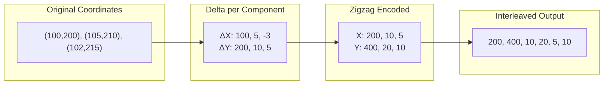

**Encoding steps:**
1. Track previous X and previous Y separately (both start at 0)
2. For each vertex, compute `delta_x = x - prev_x` and `delta_y = y - prev_y`
3. Apply [zigzag encoding](https://en.wikipedia.org/wiki/Variable-length_quantity#Zigzag_encoding): `zigzag(n) = (n << 1) ^ (n >> 31)` (maps negatives to positives)
4. Output as [varint](https://en.wikipedia.org/wiki/Variable-length_quantity): `[zigzag(Δx₀), zigzag(Δy₀), zigzag(Δx₁), zigzag(Δy₁), ...]`

**Decoding steps:**
1. Read varints in pairs
2. Apply zigzag decoding: `n = (zigzag >> 1) ^ -(zigzag & 1)`
3. Accumulate: `x = prev_x + delta_x`, `y = prev_y + delta_y`

##### Dictionary Encoding (Optional)

When vertices repeat frequently, a dictionary encoding may be used:

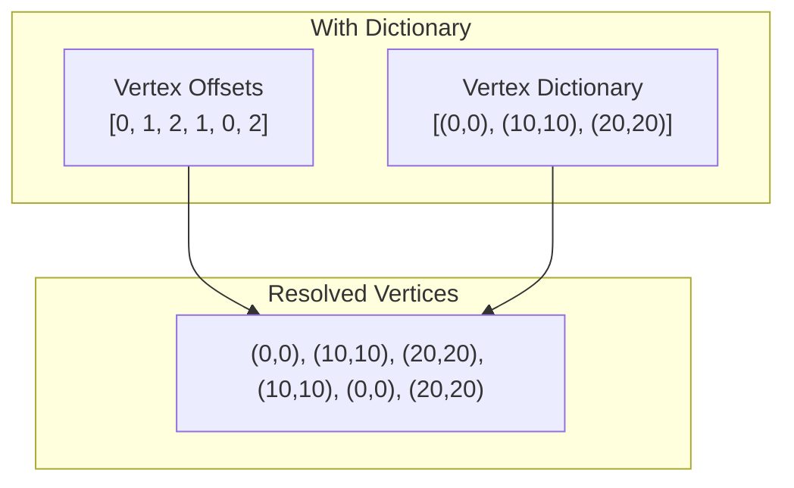

The vertex dictionary is sorted by [Hilbert curve](https://en.wikipedia.org/wiki/Hilbert_curve) index for spatial locality. The `OFFSET/VERTEX` stream contains indices into this dictionary.

##### Morton Encoding (Optional)

For spatial optimization, vertices can be [Morton-encoded](https://en.wikipedia.org/wiki/Z-order_curve) (Z-order curve):

```
Coordinate (5, 3):
  X bits: 1 0 1
  Y bits: 0 1 1
  Interleaved: 01 10 11 = 011011₂ = 27

Stored as: Morton code + metadata (numBits, coordinateShift)
```

Morton encoding enables efficient spatial clustering and range queries.

#### Integer Stream Encoding

Topology streams (lengths, offsets) use adaptive encoding selected for minimal size. All integer encodings use [variable-length quantity (varint)](https://en.wikipedia.org/wiki/Variable-length_quantity) as the base encoding:

| Logical Encoding | Format                    | Best For            |
|------------------|---------------------------|---------------------|
| None             | Plain varints             | Random values       |
| Delta            | Delta + zigzag + varint   | Monotonic sequences |
| RLE              | Run-length encoded        | Repeated values     |
| DeltaRLE         | Delta + RLE               | Constant increments |

##### RLE Format

[Run-length encoding](https://en.wikipedia.org/wiki/Run-length_encoding) stores runs followed by values:

```
Input:  [5, 5, 5, 3, 3, 3, 3]
Runs:   [3, 4]        // 3 fives, 4 threes
Values: [5, 3]
Output: [3, 4, 5, 3]  // runs concatenated with values
```

Stream metadata includes `runs` and `num_rle_values` counts for decoding.

#### Tessellation Data (Optional)

Pre-tessellated polygons include additional streams for direct GPU rendering:

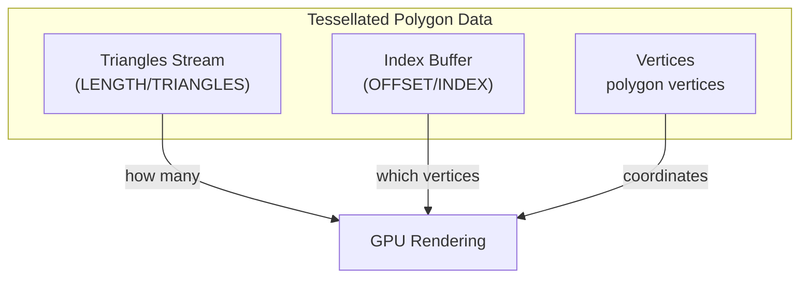

**Example** - A square polygon tessellated into 2 triangles:

```
Vertices: [(0,0), (100,0), (100,100), (0,100)]
Triangles: [2]                    // This polygon has 2 triangles
Index buffer: [0, 1, 2, 0, 2, 3]  // Triangle 1: v0,v1,v2; Triangle 2: v0,v2,v3
```

#### Decoding Examples

##### Point

```
Streams:
  META: types = [0]          // Point
  DATA/VERTEX: [200, 400]    // zigzag-encoded deltas

Decode:
  zigzag(200) = 100, zigzag(400) = 200
  Result: Point(100, 200)
```

##### LineString

```
Streams:
  META: types = [1]                 // LineString
  LENGTH/PARTS: [3]                 // 3 vertices
  DATA/VERTEX: [0,0, 200,0, 0,200]  // encoded deltas

Decode:
  part_offsets = [0, 3]                   // from lengths
  vertices = [(0,0), (100,0), (100,100)]  // delta-decoded
  Result: LineString with 3 vertices
```

##### Polygon with Hole

```
Streams:
  META: types = [2]          // Polygon
  LENGTH/PARTS: [2]          // 2 rings (exterior + 1 hole)
  LENGTH/RINGS: [4, 4]       // 4 vertices each ring
  DATA/VERTEX: [...]         // 8 vertices total

Decode:
  part_offsets = [0, 2]      // 1 polygon with 2 rings
  ring_offsets = [0, 4, 8]   // ring boundaries
  Result: Polygon with exterior ring (4 verts) and hole (4 verts)
```

##### MultiPolygon

```
Streams:
  META: types = [5]          // MultiPolygon
  LENGTH/GEOMETRIES: [2]     // 2 polygons
  LENGTH/PARTS: [1, 1]       // 1 ring each
  LENGTH/RINGS: [4, 4]       // 4 vertices each
  DATA/VERTEX: [...]         // 8 vertices total

Decode:
  geometry_offsets = [0, 2]  // spans indices 0-1 in parts
  part_offsets = [0, 1, 2]   // each polygon has 1 ring
  ring_offsets = [0, 4, 8]   // vertex boundaries
  Result: MultiPolygon with 2 simple polygons
```

#### Mixed Geometry Columns

A single column can contain mixed geometry types. The decoding logic handles this by:

1. Reading geometry types to determine which length streams to expect
2. Iterating through features, applying type-specific offset rules
3. Using implicit length=1 for simple types (Point, LineString, Polygon) and reading explicit lengths for Multi* types

**Example**: `[Point, LineString, Polygon]` in one column:

```
Streams:
  META: types = [0, 1, 2]
  LENGTH/PARTS: [1]          // Polygon: 1 ring
  LENGTH/RINGS: [3, 4]       // LineString: 3 verts, Polygon ring: 4 verts
  DATA/VERTEX: [...]         // 1 + 3 + 4 = 8 vertices

Decode:
  Point: vertices[0]
  LineString: vertices[1..4] // from ring_offsets (Polygon present)
  Polygon: vertices[4..8]    // from ring_offsets
```

#### Geometry Encoding References

- [Variable-length quantity (varint)](https://en.wikipedia.org/wiki/Variable-length_quantity) - base integer encoding
- [Zigzag encoding](https://en.wikipedia.org/wiki/Variable-length_quantity#Zigzag_encoding) - signed-to-unsigned mapping
- [Run-length encoding](https://en.wikipedia.org/wiki/Run-length_encoding) - compression for repeated values
- [Morton code (Z-order curve)](https://en.wikipedia.org/wiki/Z-order_curve) - spatial indexing
- [Hilbert curve](https://en.wikipedia.org/wiki/Hilbert_curve) - spatial indexing with better locality
- [Delta encoding](https://en.wikipedia.org/wiki/Delta_encoding) - storing differences between values

### Property Columns

Feature properties are divided into `feature-scoped` and `vertex-scoped` properties.

- **Feature-scoped**: One value per feature.
- **Vertex-scoped**: One value per vertex in the VertexBuffer per feature (modeling M-coordinates from GIS).

!!! TODO
    Would it make sense to place vertex-scoped properties AFTER feature scoped ones?
    I suspect some implementations may act of feature-scoped properties first, and possibly even ignore vertex-scoped, at least for now (esp since vertex-scoped ones are still experimental)

Vertex-scoped properties must be grouped together and placed before feature-scoped properties in the FeatureTable.
A property's scope is defined in the tileset metadata using the `ColumnScope` enum.

A property column can use any data type from the [type system](#type-system).

# Example Layouts

The following examples illustrate the layout of a `FeatureTable` in storage. The color scheme is:

- **Blue boxes**:
  Logical constructs, not persisted.
  Fields are reconstructed from streams based on TileSet metadata.
- **White boxes**:
  Metadata describing data structure (FeatureTable, Stream (SM), Feature (FM) metadata).
- **Yellow boxes**:
  Streams containing the actual data.

## Place Layer

Given a place [layer](assets/spec/place_feature.json) with the following JSON schema structure:
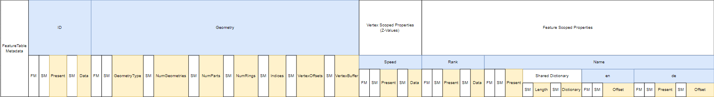

The resulting MLT tile layout for this layer, using a dictionary for the `geometry` and `name` columns, might look like this:
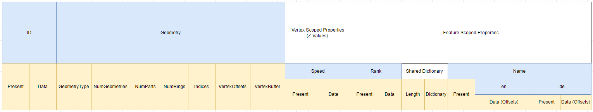

## LineString Geometry with Flat Properties

Encoding of a `FeatureTable` with an `id` field, a `LineString` geometry field, and the flat feature-scoped properties `class` and `subclass`:
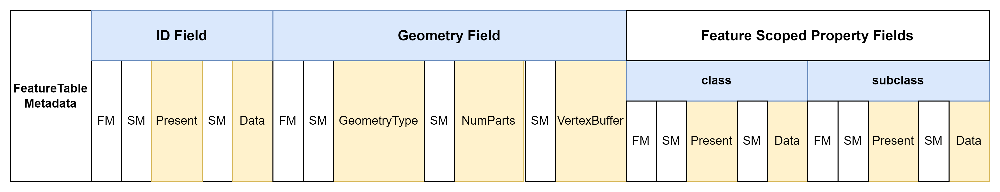

## MultiPolygon with Flat Properties

Encoding of a `FeatureTable` with an `id` field, a `MultiPolygon` geometry field, and flat feature-scoped property fields.
A `VertexOffsets` stream is present due to vertex dictionary encoding:
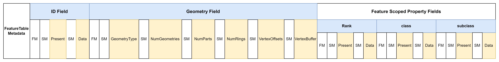

## Vertex-Scoped and Feature-Scoped Properties

Example layout encoding vertex-scoped and feature-scoped properties.
All vertex-scoped properties are grouped together and placed before feature-scoped properties.
The `id` column is not nullable, so its present stream is omitted.
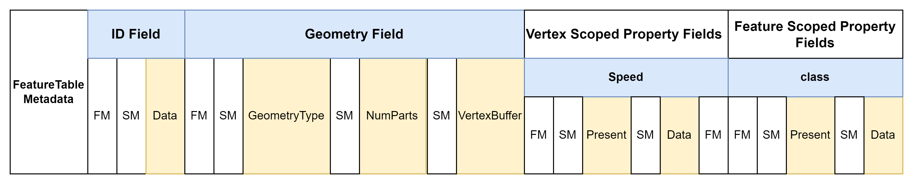

# Sorting

Choosing the right column to sort features by can significantly reduce the size of the `FeatureTable`.
Sorting is crucial for leveraging the columnar layout fully.
Exhaustively testing every possible sorting order for every column in every layer is computationally expensive.
See recommended heuristic in the [encoding schemes](#encoding-schemes).

# Encodings

!!! TODO
    inline encodings here

Encoding details are specified in [a separate document](encodings.md).

# In-Memory Format

!!! NOTE
    The following is a high-level overview; the in-memory format will be explained in more detail later.

The record-oriented, array-of-structures in-memory model used by libraries processing Mapbox Vector Tiles incurs considerable overhead.
This includes creating many small objects (increasing memory allocation load) and placing additional strain on garbage collectors in browsers.

MLT uses a columnar memory layout (data-oriented design) for its in-memory format to overcome these issues.
This approach improves cache utilization for subsequent data access and enables the use of fast SIMD instructions.
The MLT in-memory format incorporates ideas from analytical in-memory formats like Apache Arrow, Velox, and the DuckDB execution format, tailored for visualization use cases.
It is also designed for future parallel processing on the GPU within compute shaders.

The main design goals for the MLT in-memory format are:

- Define a platform-agnostic representation to avoid expensive materialization costs, especially for strings.
- Maximize CPU throughput by optimizing memory layout for cache locality and SIMD instructions.
- Allow random (preferably constant-time) access to all data for parallel processing on GPUs (compute shaders).
- Provide compressed data structures that can be processed directly without full decoding.
- Provide tile geometries in a representation that can be loaded into GPU buffers with minimal additional processing.

Data is stored in contiguous memory buffers called **vectors**, accompanied by metadata and an optional null bitmap.
The storage format includes a `VectorType` field in the metadata to instruct the decoder which vector type to use for a specific field.
An auxiliary offset buffer enables random access to variable-sized data types like strings or lists.

The MLT in-memory format supports the following vector types:

- [Flat Vectors](https://duckdb.org/internals/vector.html#flat-vectors)
- [Constant Vectors](https://duckdb.org/internals/vector.html#constant-vectors)
- [Sequence Vectors](https://duckdb.org/internals/vector.html#sequence-vectors)
- [Dictionary Vectors](https://duckdb.org/internals/vector.html#dictionary-vectors)
- FSST Dictionary Vectors <span class="experimental"></span>
- Shared Dictionary Vectors <span class="experimental"></span>
- [Run-End Encoded (REE) Vectors](https://arrow.apache.org/docs/format/Columnar.html#run-end-encoded-layout)

!!! NOTE
    Further evaluation is needed to determine if [recent research](https://arxiv.org/pdf/2306.15374.pdf) can enable random access on delta-encoded values.

Using a compressed vector where possible makes the conversion from storage to in-memory format essentially a zero-copy operation.

Following Apache Arrow's approach and the [Intel performance guide](https://www.intel.com/content/www/us/en/developer/topic-technology/data-center/overview.html), decoders should allocate memory on addresses aligned to a 64-byte multiple (where possible).
