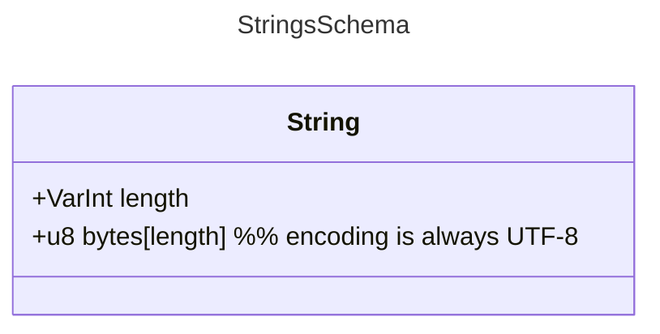
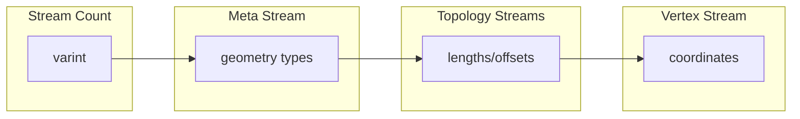
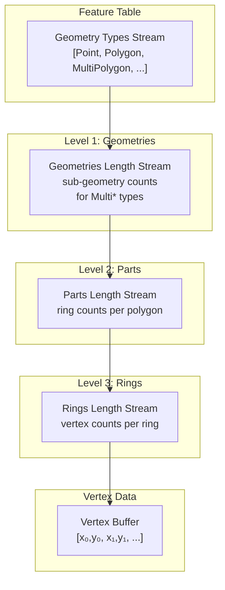
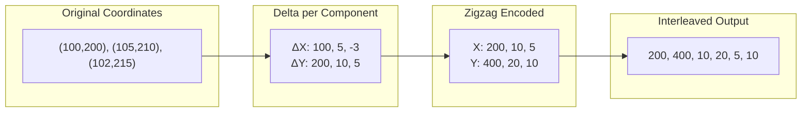
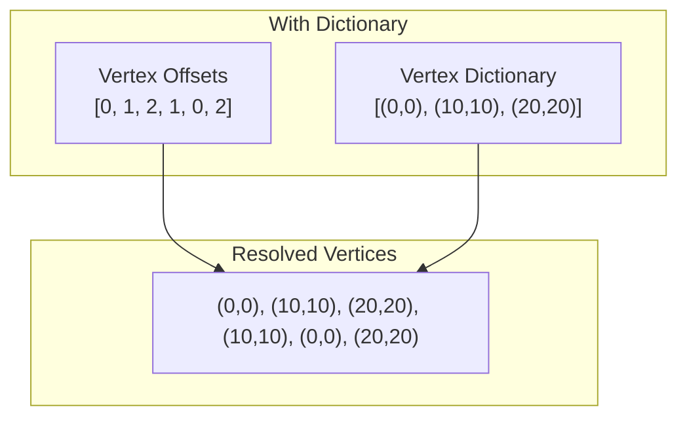
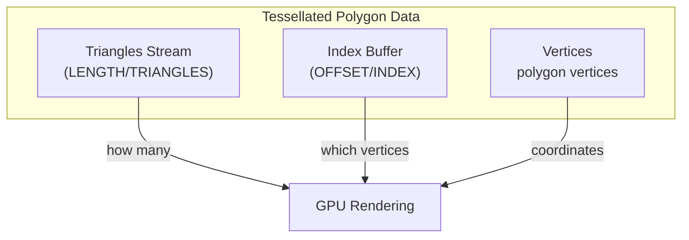

<h1>MapLibre Tile Specification v1</h1>

--8<-- "live-spec-note"

[TOC]

---

This document specifies the byte layout of an MLT v1 layer.
The data model it assumes, tiles, extents, layers, features, columns and streams, is described in the [Overview](../overview.md).

Only implemented features are specified here.
Complex and nested property types, logical types, linear referencing, vertex-scoped m-values and separate tileset metadata were designed for v1 but never implemented.
They are being redesigned for [MLT v2](v2.md).

Everything below is normative.
All integers are `VarInt`-encoded unless stated otherwise.
`VarInt` is [Protobuf's base 128 varint](https://protobuf.dev/programming-guides/encoding/#varints), least significant group first.
Signed varints are ZigZag-encoded before being written.

# Tile Layout

A tile is a concatenation of tagged layer records.
There is no tile header.
Layers are encoded independently and can be concatenated without re-encoding.

```
tile   := layer*
layer  := [varint size] [u8 tag] [u8 body[size - 1]]
```

- `size` counts the `tag` byte plus the body, so the next layer starts `size` bytes after the `size` varint.
- `tag` names the format the body is written in. `0x01` is the format specified on this page.
- A decoder MUST skip a layer whose `tag` it does not recognize, using `size` to find the next one.

A decoder MUST NOT assume layer names are unique or ordered.

# Layer Body

A v1 layer body is a header, then every column's metadata, then every column's data:

```
body := [string name]
        [varint extent]
        [varint column_count]
        column_meta * column_count
        column_data * column_count
```

Strings are a `VarInt` byte length followed by that many UTF-8 bytes:



`name` MUST NOT be empty.

`extent` defines the coordinate space size for the tile's geometry and MUST NOT be zero.
Geometry coordinates are signed integers in vector-tile grid coordinates, typically near the `0..=extent` range but not restricted to it.
Values MAY be negative or exceed `extent` for geometry that crosses tile boundaries.
Encoders MAY default to `4096` when a user does not specify the extent.

Metadata and data are in two separate sections, both in `column_count` order.

A layer MUST contain exactly one geometry column and at most one id column.

## Column Metadata

Each column's metadata is a single type byte, optionally followed by a name and, for shared dictionaries, its children:

```
column_meta := [u8 column_type]
               [string name]                              -- unless the type is Id or Geometry
               [varint child_count] [child_meta*]         -- SharedDict only
child_meta  := [u8 column_type] [string name]
```

Id and Geometry columns are named implicitly by their type and carry no name field.

### Column Types

The low bit of the type byte is the nullability flag: an odd code is the nullable variant of the even code below it.
A nullable column writes a `Present` stream before its data.

| Code | Type | Nullable variant | Description |
|-----:|------|-----------------:|-------------|
| `0` | `Id` | `1` (`OptId`) | Feature id, up to 32 bits |
| `2` | `LongId` | `3` (`OptLongId`) | Feature id, up to 64 bits |
| `4` | `Geometry` | - | The layer's geometry column, never nullable |
| `10` | `Bool` | `11` | |
| `12` | `Int8` | `13` | |
| `14` | `UInt8` | `15` | |
| `16` | `Int32` | `17` | |
| `18` | `UInt32` | `19` | |
| `20` | `Int64` | `21` | |
| `22` | `UInt64` | `23` | |
| `24` | `Float` | `25` | IEEE 754 binary32 |
| `26` | `Double` | `27` | IEEE 754 binary64 |
| `28` | `String` | `29` | UTF-8 |
| `30` | `SharedDict` | - | A string dictionary and the columns that index into it |

Codes `5`-`9` and `31` are unassigned.
A decoder MUST reject a column whose type byte is unassigned.

## Column Data

What follows in the data section depends on the column's type.
Every `[stream]` below is one stream, laid out as described under [Streams](#streams).

| Column type | Data layout |
|---|---|
| `Id`, `LongId` | `[data stream]` |
| `Geometry` | `[varint stream_count]` `[types stream]` `[stream * (stream_count - 1)]` |
| Scalar (`Bool` … `Double`) | `[data stream]` |
| `String` | `[varint stream_count]` `[stream * stream_count]` |
| `SharedDict` | see [Shared Dictionary Columns](#shared-dictionary-columns) |

A nullable column prefixes its data with a `Present` stream, which is counted in `stream_count` where one is present.

# Streams

A logical column is separated into several physical `streams` (sub-columns), inspired by the ORC file format.
These streams are stored contiguously.
A stream is a sequence of values of a known length in a continuous memory chunk, all sharing the same type.

Each stream is a header followed by its payload:

```
stream := [u8 stream_type]        category (bits 7-4) | subtype (bits 3-0)
          [u8 encoding]           logical1 (bits 7-5) | logical2 (bits 4-2) | physical (bits 1-0)
          [varint num_values]
          [varint byte_length]
          [varint runs]           RLE streams only, except Present streams
          [varint num_rle_values] RLE streams only, except Present streams
          [varint bits]           Morton streams only
          [varint shift]          Morton streams only
          [u8 payload[byte_length]]
```

`num_values` is the number of values the stream holds after decoding.
`byte_length` is the payload size and allows a decoder to skip the stream.

A `Present` stream is always boolean and derives its RLE parameters from `num_values`.

## Stream Types

The `stream_type` byte names what role the stream plays.
The high nibble is the category and the low nibble is a category-specific subtype.

| Category | Code | Subtypes |
|---|---:|---|
| `Present` | `0x0` | - |
| `Data` | `0x1` | `0` None, `1` Single dictionary, `2` Shared dictionary, `3` Vertex, `4` Morton, `5` FSST |
| `Offset` | `0x2` | `0` Vertex, `1` Index, `2` String, `3` Key |
| `Length` | `0x3` | `0` VarBinary, `1` Geometries, `2` Parts, `3` Rings, `4` Triangles, `5` Symbol, `6` Dictionary |

What each category holds:

- **Present**: enables efficient encoding of sparse columns by indicating value presence via a bit flag. Omitted when the column is not nullable.
- **Data**: the actual column data - `boolean`, `int`, `float` or `string` values, dictionary entries, or geometry coordinates. For fixed-size data types this is the only required stream besides the optional `Present` stream.
- **Length**: the number of elements for variable-sized data types like strings or rings.
- **Offset**: offsets into a data stream when using dictionary encoding, for strings or vertices.

## Encoding Byte

The encoding byte gives the encoding of the payload.
The two logical fields form one combination.
Any combination not listed below is invalid.

| Combination | logical1 (bits 7-5) | logical2 (bits 4-2) | Meaning |
|---|---|---|---|
| `None` | `000` | `000` | Values as they are |
| `Delta` | `001` | `000` | ZigZag deltas between consecutive values |
| `DeltaRle` | `001` | `011` | Delta, then RLE |
| `ComponentwiseDelta` | `010` | `000` | Deltas per coordinate component, for vertex streams |
| `Rle` | `011` | `000` | Run-length encoded |
| `Morton` | `100` | `000` | Morton (Z-order) codes, for vertex streams |
| `MortonDelta` | `100` | `001` | Deltas between Morton codes |
| `MortonRle` | `100` | `011` | RLE over Morton codes |

The physical field (bits 1-0) says how the resulting integers are laid out in bytes:

| Code | Physical |
|---|---|
| `00` | None - fixed-width little-endian words |
| `01` | SIMD-FastPFOR, 256-value big-endian blocks |
| `10` | VarInt |

RLE streams store all run lengths first, then all values, and carry `runs` and `num_rle_values` in the header.

The algorithms themselves are specified in [Encoding Definitions](../encodings.md).

# Property Columns

## ID Column

An `id` column is not mandatory.
If included, it should be `UInt64` or narrower (`UInt32` if possible) for MVT compatibility.
A narrower type enables the use of efficient encodings like SIMD-FastPFOR.

## Scalar Columns

Boolean, integer and floating-point columns are a `Present` stream when nullable, then one data stream.
Boolean data streams are bit-packed, one bit per present value; float and double data streams hold fixed-width IEEE 754 words.

## String Columns

A string column declares how many streams follow, and the number of streams determines its layout:

| Streams | Layout | Stream order |
|--------:|--------|--------------|
| 2 | Plain | `Length/VarBinary`, `Data/None` |
| 3 | Dictionary | `Length/Dictionary`, `Offset/String`, `Data/Single` |
| 4 | FSST | `Length/Symbol`, `Data/FSST`, `Length/Dictionary`, `Data/Single` |
| 5 | FSST dictionary | `Length/Symbol`, `Data/FSST`, `Length/Dictionary`, `Data/Single`, `Offset/String` |

A nullable column's `Present` stream precedes these and is counted in `stream_count`.

In the plain layout the `Length` stream holds the byte length of each present value and the `Data` stream holds their UTF-8 bytes back to back.
In a dictionary layout the `Offset/String` stream holds one dictionary index per present value, and the `Length` and `Data` streams describe the distinct values.
FSST layouts compress the value bytes with a symbol table; see [FSST](../encodings.md#fsst-dictionary-encoding).

The offset stream comes last in the 5-stream layout and before the data stream in the 3-stream layout.
An encoder MAY also use the 5-stream layout for an undeduplicated FSST corpus, writing the identity `[0, 1, 2, …]` as its offsets.

## Shared Dictionary Columns

Several string columns, such as `name:en`, `name:de` and `name:fr`, can share a single dictionary.

```
shared_dict := [varint stream_count]
               [dictionary streams]     2 (plain) or 4 (FSST), as in the table above
               child * child_count      child_count comes from the column metadata
child       := [varint stream_count]
               [present stream]         only when the child's type is nullable
               [offset stream]          one dictionary index per present value
```

`stream_count` on the column counts every stream that follows: the dictionary streams, one offset stream per child, and one present stream per nullable child.
The dictionary streams end at the `Data/Single` or `Data/Shared` stream.
The children begin after it.

!!! NOTE
    Some tiles in the wild were written with `stream_count` one too high, by an encoder bug since fixed.
    Decoders SHOULD accept `expected + 1` as well so those files still parse.

Each child's own `stream_count` is `1`, plus `1` when it is nullable.

# Geometry Column {#geometry-column}

The geometry column uses a Structure of Arrays (SoA) layout (data-oriented design).
The `x`, `y` coordinates are stored interleaved in a `VertexBuffer` for efficient CPU processing and direct copying to GPU buffers.

The geometry information is separated into different streams, partly inspired by the [geoarrow](https://github.com/geoarrow/geoarrow) specification.
This separation enables better compression optimization and faster processing.
Pre-tessellated polygon meshes can also be stored directly to avoid runtime triangulation.

A geometry column can consist of the following streams:

| Stream Name    | Data Type | Encoding         | Mandatory |
| -------------- | :-------: | ------------------ | :-------: |
| GeometryType  |   Byte    | Integer |     ✓     |
| NumGeometries |   UInt32  | Integer |         |
| NumParts      |   UInt32  | Integer |         |
| NumRings      |   UInt32  | Integer |         |
| NumTriangles  |   UInt32  | Integer |         |
| IndexBuffer   |   UInt32  | Integer |         |
| VertexOffsets |   UInt32  | Integer |         |
| VertexBuffer  | Int32 or Vertex[] | Plain, Dictionary, Morton |     ✓     |

Depending on the geometry type, the following streams are used in addition to `GeometryType`:

- **Point**: VertexBuffer
- **LineString**: NumParts, VertexBuffer
- **Polygon**: NumParts (Polygon), NumRings (LinearRing), VertexBuffer
- **MultiPoint**: NumGeometries, VertexBuffer
- **MultiLineString**: NumGeometries, NumParts (LineString), VertexBuffer
- **MultiPolygon**: NumGeometries, NumParts (Polygon), NumRings (LinearRing), VertexBuffer

When LineString and Polygon types are mixed in the same column, LineString vertex counts are stored in the NumRings stream (see [Length Stream Encoding Rules](#length-stream-encoding-rules) below).

An additional `VertexOffsets` stream is present when using Dictionary or Morton-Dictionary encoding.
If geometries (mainly polygons) are pre-tessellated for direct GPU use, `NumTriangles` and `IndexBuffer` streams must be provided.

## Geometry Types

Six geometry types are supported, encoded as unsigned integers:

| Value | Type            | Description                                       |
|-------|-----------------|---------------------------------------------------|
| 0     | Point           | Single coordinate                                 |
| 1     | LineString      | Sequence of coordinates forming a line            |
| 2     | Polygon         | Closed rings (exterior + optional interior holes) |
| 3     | MultiPoint      | Collection of points                              |
| 4     | MultiLineString | Collection of line strings                        |
| 5     | MultiPolygon    | Collection of polygons                            |

## Binary Structure

A geometry column is stored as a sequence of streams, prefixed by a stream count:



The streams listed above map to the following physical and logical stream types:

| Physical Type | Logical Type | Specification Name | Content                                                   |
|---------------|--------------|--------------------|-----------------------------------------------------------|
| `DATA`        | `NONE`       | GeometryType       | Geometry type per feature (see [Geometry Types](#geometry-types)) |
| `LENGTH`      | `GEOMETRIES` | NumGeometries      | Number of sub-geometries in Multi* types                  |
| `LENGTH`      | `PARTS`      | NumParts           | Number of rings per polygon or lines per multi-linestring |
| `LENGTH`      | `RINGS`      | NumRings           | Number of vertices per ring or per linestring segment     |
| `LENGTH`      | `TRIANGLES`  | NumTriangles       | Number of triangles per polygon (tessellated)             |
| `OFFSET`      | `INDEX`      | IndexBuffer        | Triangle vertex indices (tessellated)                     |
| `OFFSET`      | `VERTEX`     | VertexOffsets      | Indices into vertex dictionary                            |
| `DATA`        | `VERTEX`     | VertexBuffer       | Vertex coordinates (x, y pairs)                           |
| `DATA`        | `MORTON`     | VertexBuffer       | Morton-encoded vertex coordinates                         |

## Topology Encoding

MLT uses a **length-based** encoding for geometry topology rather than explicit drawing commands. This enables efficient random access to individual features.

### Conceptual Hierarchy



### Which Streams Are Present

The streams included depend on the geometry types in the column:

| Geometry Type   | Geometries | Parts | Rings |
|-----------------|:----------:|:-----:|:-----:|
| Point           |     -      |   -   |   -   |
| MultiPoint      |     ✓      |   -   |   -   |
| LineString      |     -      |  ✓*   |   -   |
| MultiLineString |     ✓      |  ✓*   |   -   |
| Polygon         |     -      |   ✓   |   ✓   |
| MultiPolygon    |     ✓      |   ✓   |   ✓   |

*LineString and MultiLineString parts are stored in the Rings stream when Polygons are also present in the same column.

### Length Stream Encoding Rules

Length values are stored only for geometry types that need them. The key insight is that **simple types have an implicit count of 1**, while **Multi\* types store their sub-geometry counts explicitly**.

The encoding uses a **type threshold** to determine which geometries need explicit lengths:

| Stream            | Threshold | Types Needing Explicit Length  |
|-------------------|-----------|-------------------------------|
| `geometry_offsets`                    | Polygon    | MultiPoint, MultiLineString, MultiPolygon          |
| `part_offsets` (Rings stream present) | LineString | Polygon, MultiPoint, MultiLineString, MultiPolygon |
| `part_offsets` (no Rings stream)      | Point      | LineString                                         |

**Rule**: If a geometry type's value is greater than the threshold type's value (see [Geometry Types](#geometry-types) table), store its length explicitly. Otherwise, the length is implicitly 1.

**Example**: A column with `[Point, MultiPolygon, Polygon]` geometry types:

```
Encoded geometries lengths: [3]     // Only MultiPolygon needs explicit count
                                    // (MultiPolygon=5 > Polygon=2)

Decoding to offsets:
  Point:        implicit 1  -> offset 0->1   (Point=0, not greater than Polygon=2)
  MultiPolygon: explicit 3  -> offset 1->4   (MultiPolygon=5 > Polygon=2, read from stream)
  Polygon:      implicit 1  -> offset 4->5   (Polygon=2, not greater than Polygon=2)

Result: geometry_offsets = [0, 1, 4, 5]
```

## Vertex Encoding

### Componentwise Delta Encoding

Vertices are stored as interleaved (x, y) coordinate pairs using **componentwise delta encoding**:



**Encoding steps:**

1. Track previous X and previous Y separately (both start at 0)
2. For each vertex, compute `delta_x = x - prev_x` and `delta_y = y - prev_y`
3. Apply [zigzag encoding](https://en.wikipedia.org/wiki/Variable-length_quantity#Zigzag_encoding): `zigzag(n) = (n << 1) ^ (n >> 31)` (maps negatives to positives)
4. Output as [varint](https://en.wikipedia.org/wiki/Variable-length_quantity): `[zigzag(Δx₀), zigzag(Δy₀), zigzag(Δx₁), zigzag(Δy₁), ...]`

**Decoding steps:**

1. Read varints in pairs
2. Apply zigzag decoding: `n = (zigzag >> 1) ^ -(zigzag & 1)`
3. Accumulate: `x = prev_x + delta_x`, `y = prev_y + delta_y`

### Dictionary Encoding (Optional)

When vertices repeat frequently, a dictionary encoding may be used:



The vertex dictionary is sorted by [Hilbert curve](https://en.wikipedia.org/wiki/Hilbert_curve) index for spatial locality. The `OFFSET/VERTEX` stream contains indices into this dictionary.

### Morton Encoding (Optional)

For spatial optimization, vertices can be [Morton-encoded](https://en.wikipedia.org/wiki/Z-order_curve) (Z-order curve):

```
Coordinate (5, 3):
  X bits: 1 0 1
  Y bits: 0 1 1
  Interleaved: 01 10 11 = 011011₂ = 27

Stored as: Morton code + metadata (numBits, coordinateShift)
```

Morton encoding enables efficient spatial clustering and range queries.

## Integer Stream Encoding

Topology streams (lengths, offsets) use adaptive encoding selected for minimal size. All integer encodings use [variable-length quantity (varint)](https://en.wikipedia.org/wiki/Variable-length_quantity) as the base encoding:

| Logical Encoding | Format                    | Best For            |
|------------------|---------------------------|---------------------|
| None             | Plain varints             | Random values       |
| Delta            | Delta + zigzag + varint   | Monotonic sequences |
| RLE              | Run-length encoded        | Repeated values     |
| DeltaRLE         | Delta + RLE               | Constant increments |

### RLE Format

[Run-length encoding](https://en.wikipedia.org/wiki/Run-length_encoding) stores runs followed by values:

```
Input:  [5, 5, 5, 3, 3, 3, 3]
Runs:   [3, 4]        // 3 fives, 4 threes
Values: [5, 3]
Output: [3, 4, 5, 3]  // runs concatenated with values
```

Stream metadata includes `runs` and `num_rle_values` counts for decoding.

## Tessellation Data (Optional)

Pre-tessellated polygons include additional streams for direct GPU rendering:



**Example** - A square polygon tessellated into 2 triangles:

```
Vertices: [(0,0), (100,0), (100,100), (0,100)]
Triangles: [2]                    // This polygon has 2 triangles
Index buffer: [0, 1, 2, 0, 2, 3]  // Triangle 1: v0,v1,v2; Triangle 2: v0,v2,v3
```

## Decoding Examples

### Point

```
Streams:
  META: types = [0]          // Point
  DATA/VERTEX: [200, 400]    // zigzag-encoded deltas

Decode:
  zigzag(200) = 100, zigzag(400) = 200
  Result: Point(100, 200)
```

### LineString

```
Streams:
  META: types = [1]                 // LineString
  LENGTH/PARTS: [3]                 // 3 vertices
  DATA/VERTEX: [0,0, 200,0, 0,200]  // encoded deltas

Decode:
  part_offsets = [0, 3]                   // from lengths
  vertices = [(0,0), (100,0), (100,100)]  // delta-decoded
  Result: LineString with 3 vertices
```

### Polygon with Hole

```
Streams:
  META: types = [2]          // Polygon
  LENGTH/PARTS: [2]          // 2 rings (exterior + 1 hole)
  LENGTH/RINGS: [4, 4]       // 4 vertices each ring
  DATA/VERTEX: [...]         // 8 vertices total

Decode:
  part_offsets = [0, 2]      // 1 polygon with 2 rings
  ring_offsets = [0, 4, 8]   // ring boundaries
  Result: Polygon with exterior ring (4 verts) and hole (4 verts)
```

### MultiPolygon

```
Streams:
  META: types = [5]          // MultiPolygon
  LENGTH/GEOMETRIES: [2]     // 2 polygons
  LENGTH/PARTS: [1, 1]       // 1 ring each
  LENGTH/RINGS: [4, 4]       // 4 vertices each
  DATA/VERTEX: [...]         // 8 vertices total

Decode:
  geometry_offsets = [0, 2]  // spans indices 0-1 in parts
  part_offsets = [0, 1, 2]   // each polygon has 1 ring
  ring_offsets = [0, 4, 8]   // vertex boundaries
  Result: MultiPolygon with 2 simple polygons
```

## Mixed Geometry Columns

A single column can contain mixed geometry types. The decoding logic handles this by:

1. Reading geometry types to determine which length streams to expect
2. Iterating through features, applying type-specific offset rules
3. Using implicit length=1 for simple types (Point, LineString, Polygon) and reading explicit lengths for Multi* types

**Example**: `[Point, LineString, Polygon]` in one column:

```
Streams:
  META: types = [0, 1, 2]
  LENGTH/PARTS: [1]          // Polygon: 1 ring
  LENGTH/RINGS: [3, 4]       // LineString: 3 verts, Polygon ring: 4 verts
  DATA/VERTEX: [...]         // 1 + 3 + 4 = 8 vertices

Decode:
  Point: vertices[0]
  LineString: vertices[1..4] // from ring_offsets (Polygon present)
  Polygon: vertices[4..8]    // from ring_offsets
```

The integer and vertex encodings referenced above are specified in detail in the [Encoding Definitions](../encodings.md) document.

# Choosing Encodings

MLT uses various lightweight compression schemes for space-efficient storage and fast decoding.
Encodings can be recursively cascaded (hybrid encodings) to a certain degree.
For example, integer columns resulting from dictionary encoding can be further compressed using integer encoding schemes.

The following encoding pool was selected based on analysis of compression ratio and decoding speed on test datasets like OpenMapTiles and Bing Maps tilesets.

| Data Type | Logical Level Technique      | Physical Level Technique          |
| --------- | ---------------------------- | ----------------------------------- |
| Boolean   | [Boolean RLE](https://orc.apache.org/specification/ORCv1/#boolean-run-length-encoding) | |
| Integer   | Plain, RLE, Delta, Delta-RLE | [SIMD-FastPFOR](https://arxiv.org/pdf/1209.2137.pdf), [Varint](https://protobuf.dev/programming-guides/encoding/#varints) |
| Float     | Plain, RLE | |
| String    | Plain, Dictionary, [FSST](https://www.vldb.org/pvldb/vol13/p2649-boncz.pdf), FSST Dictionary | |
| Geometry  | Plain, Dictionary, Morton-Dictionary | |

SIMD-FastPFOR is generally preferred over Varint encoding due to its smaller output and faster decoding speed.
Varint encoding is included mainly for compatibility and simplicity, and it can be more efficient when combined with heavyweight compression like GZip.

A brute-force search for the best encoding scheme is too costly.
Instead, we recommend the selection strategy from the [BTRBlocks](https://www.cs.cit.tum.de/fileadmin/w00cfj/dis/papers/btrblocks.pdf) paper:

- Calculate data metrics to exclude unsuitable encodings early (e.g., exclude RLE if the average run length is less than 2).
- Use a sampling-based algorithm: randomly select parts of the data totaling ~1% of the full dataset and apply the candidate encodings from step 1.
  Choose the scheme that produces the smallest output.

Choosing the right column to sort features by can also significantly reduce the size of a layer, and is crucial for leveraging the columnar layout fully.
Exhaustively testing every possible sorting order for every column in every layer is computationally expensive, so the same sampling heuristic applies.

# Examples

Every fixture under `test/synthetic/0x01/` has an annotated hexdump and the `.json` a decoder MUST produce from it.
The annotations are generated from the tiles.

The same annotation can be produced for any tile with the [`mlt` CLI](https://github.com/maplibre/maplibre-tile-spec/blob/main/rust/mlt/README.md):

```bash
mlt hexdump path/to/tile.mlt
```

=== "Minimal layer"

    One point with one id: the tile envelope, the column metadata section and the data section.

    ```
    --8<-- "0x01/id.mlt.hexdump"
    ```

=== "Polygon with a hole"

    Part and ring length streams.

    ```
    --8<-- "0x01/poly_hole.mlt.hexdump"
    ```

=== "String property"

    A plain string column: its `stream_count`, then its length and data streams.

    ```
    --8<-- "0x01/props_str.mlt.hexdump"
    ```

=== "Shared dictionary"

    A dictionary and the child columns that index into it, each with its own presence and offset stream.

    ```
    --8<-- "0x01/props_shared_dict.mlt.hexdump"
    ```
