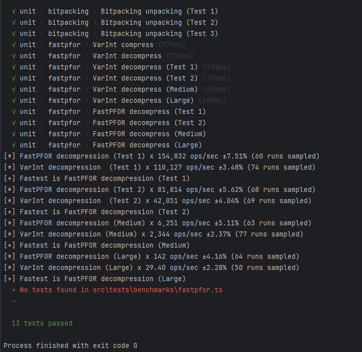

# fastpfor-ts

A Typescript implementation of the FastPFOR integer compression algorithm (decompression only). This version in TypeScript does not support SIMD instructions.

# Running the benchmarks

Can easily be done by running the `test` task in package.json, or
```
npm run test
```



---

The random examples were generated with the following python script:
```python
from random import randint

size_of_test_data = 100000
percent_of_large_numbers = 10

small_min = 0
small_max = 255
large_min = 255
large_max = 4096

a = [randint(small_min, small_max) for _ in range(0, size_of_test_data)]

for _ in range(0, size_of_test_data // 100 * percent_of_large_numbers):
  a[randint(0, size_of_test_data)] = randint(large_min, large_max)

```

_by Tom Böhm_
