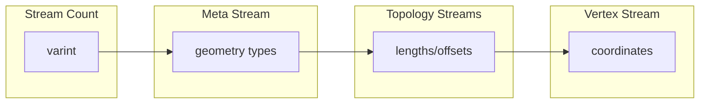
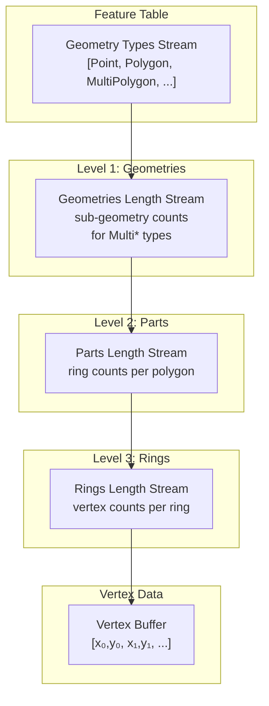
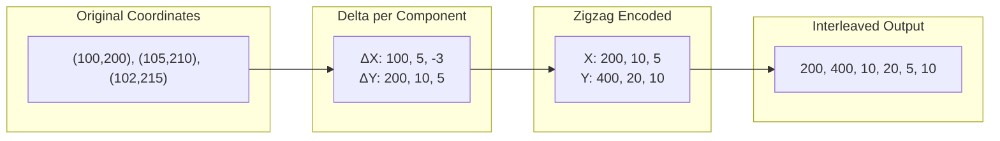
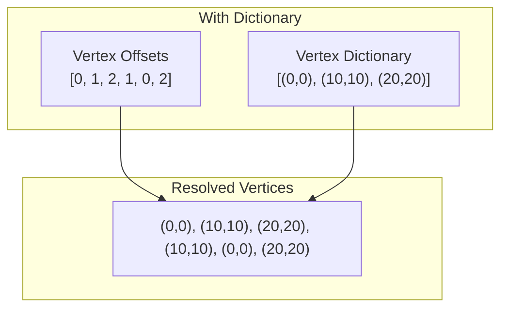
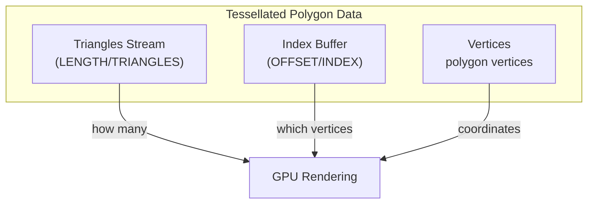

# MLT Geometry Encoding Format

This document describes the binary format for encoding vector geometries in MapLibre Tiles (MLT). It provides the detailed encoding format and decoding rules for the geometry column described in the [main specification](specification.md#geometry-column). The format is designed for efficient storage and GPU-friendly random access patterns.

## Geometry Types

Six geometry types are supported, encoded as unsigned integers:

| Value | Type            | Description                                       |
|-------|-----------------|---------------------------------------------------|
| 0     | Point           | Single coordinate                                 |
| 1     | LineString      | Sequence of coordinates forming a line            |
| 2     | Polygon         | Closed rings (exterior + optional interior holes) |
| 3     | MultiPoint      | Collection of points                              |
| 4     | MultiLineString | Collection of line strings                        |
| 5     | MultiPolygon    | Collection of polygons                            |

## Binary Structure

A geometry column is stored as a sequence of streams, prefixed by a stream count:



Each stream contains:
1. **Stream metadata** - encoding parameters (physical type, logical type, codec, value count, byte length)
2. **Encoded data** - the actual values

### Stream Types

These correspond to the streams in the [specification](specification.md#geometry-column): `GeometryType`, `NumGeometries`, `NumParts`, `NumRings`, `NumTriangles`, `IndexBuffer`, `VertexOffsets`, `VertexBuffer`.

| Physical Type | Logical Type | Specification Name | Content                                                   |
|---------------|--------------|--------------------|-----------------------------------------------------------|
| `DATA`        | `VERTEX`     | VertexBuffer       | Vertex coordinates (x, y pairs)                           |
| `DATA`        | `MORTON`     | VertexBuffer       | Morton-encoded vertex coordinates                         |
| `LENGTH`      | `GEOMETRIES` | NumGeometries      | Number of sub-geometries in Multi* types                  |
| `LENGTH`      | `PARTS`      | NumParts           | Number of rings per polygon or lines per multi-linestring |
| `LENGTH`      | `RINGS`      | NumRings           | Number of vertices per ring                               |
| `LENGTH`      | `TRIANGLES`  | NumTriangles       | Number of triangles per polygon (tessellated)              |
| `OFFSET`      | `VERTEX`     | VertexOffsets      | Indices into vertex dictionary                            |
| `OFFSET`      | `INDEX`      | IndexBuffer        | Triangle vertex indices (tessellated)                      |

## Topology Encoding

MLT uses a **length-based** encoding for geometry topology rather than explicit drawing commands. This enables efficient random access to individual features.

### Conceptual Hierarchy



### Which Streams Are Present

The streams included depend on the geometry types in the column:

| Geometry Type   | Geometries | Parts | Rings |
|-----------------|:----------:|:-----:|:-----:|
| Point           |     -      |   -   |   -   |
| MultiPoint      |     ✓      |   -   |   -   |
| LineString      |     -      |  ✓*   |   -   |
| MultiLineString |     ✓      |  ✓*   |   -   |
| Polygon         |     -      |   ✓   |   ✓   |
| MultiPolygon    |     ✓      |   ✓   |   ✓   |

*LineString parts are stored in the Rings stream when Polygons are also present in the same column.

### Length Stream Encoding Rules

Length values are stored only for geometry types that need them. The key insight is that **simple types have an implicit count of 1**, while **Multi\* types store their sub-geometry counts explicitly**.

The encoding uses a **type threshold** to determine which geometries need explicit lengths:

| Stream            | Threshold | Types Needing Explicit Length  |
|-------------------|-----------|-------------------------------|
| `geometry_offsets`| Polygon   | MultiPoint, MultiLineString, MultiPolygon |
| `part_offsets`    | LineString or Point (context-dependent) | Polygon, Multi* types |

**Rule**: If a geometry type's value is greater than the threshold type's value (see [Geometry Types](#geometry-types) table), store its length explicitly. Otherwise, the length is implicitly 1.

**Example**: A column with `[Point, MultiPolygon, Polygon]` geometry types:

```
Encoded geometries lengths: [3]     // Only MultiPolygon needs explicit count
                                    // (MultiPolygon=5 > Polygon=2)

Decoding to offsets:
  Point:        implicit 1  → offset 0→1   (Point=0, not greater than Polygon=2)
  MultiPolygon: explicit 3  → offset 1→4   (MultiPolygon=5 > Polygon=2, read from stream)
  Polygon:      implicit 1  → offset 4→5   (Polygon=2, not greater than Polygon=2)

Result: geometry_offsets = [0, 1, 4, 5]
```

## Vertex Encoding

### Componentwise Delta Encoding

Vertices are stored as interleaved (x, y) coordinate pairs using **componentwise delta encoding**:



**Encoding steps:**
1. Track previous X and previous Y separately (both start at 0)
2. For each vertex, compute `delta_x = x - prev_x` and `delta_y = y - prev_y`
3. Apply [zigzag encoding](https://en.wikipedia.org/wiki/Variable-length_quantity#Zigzag_encoding): `zigzag(n) = (n << 1) ^ (n >> 31)` (maps negatives to positives)
4. Output as [varint](https://en.wikipedia.org/wiki/Variable-length_quantity): `[zigzag(Δx₀), zigzag(Δy₀), zigzag(Δx₁), zigzag(Δy₁), ...]`

**Decoding steps:**
1. Read varints in pairs
2. Apply zigzag decoding: `n = (zigzag >> 1) ^ -(zigzag & 1)`
3. Accumulate: `x = prev_x + delta_x`, `y = prev_y + delta_y`

### Dictionary Encoding (Optional)

When vertices repeat frequently, a dictionary encoding may be used:



The vertex dictionary is sorted by [Hilbert curve](https://en.wikipedia.org/wiki/Hilbert_curve) index for spatial locality. The `OFFSET/VERTEX` stream contains indices into this dictionary.

### Morton Encoding (Optional)

For spatial optimization, vertices can be [Morton-encoded](https://en.wikipedia.org/wiki/Z-order_curve) (Z-order curve):

```
Coordinate (5, 3):
  X bits: 1 0 1
  Y bits: 0 1 1
  Interleaved: 01 10 11 = 011011₂ = 27

Stored as: Morton code + metadata (numBits, coordinateShift)
```

Morton encoding enables efficient spatial clustering and range queries.

## Integer Stream Encoding

Topology streams (lengths, offsets) use adaptive encoding selected for minimal size. All integer encodings use [variable-length quantity (varint)](https://en.wikipedia.org/wiki/Variable-length_quantity) as the base encoding:

| Logical Encoding | Format                    | Best For            |
|------------------|---------------------------|---------------------|
| None             | Plain varints             | Random values       |
| Delta            | Delta + zigzag + varint   | Monotonic sequences |
| RLE              | Run-length encoded        | Repeated values     |
| DeltaRLE         | Delta + RLE               | Constant increments |

### RLE Format

[Run-length encoding](https://en.wikipedia.org/wiki/Run-length_encoding) stores runs followed by values:

```
Input:  [5, 5, 5, 3, 3, 3, 3]
Runs:   [3, 4]        // 3 fives, 4 threes
Values: [5, 3]
Output: [3, 4, 5, 3]  // runs concatenated with values
```

Stream metadata includes `runs` and `num_rle_values` counts for decoding.

## Tessellation Data (Optional)

Pre-tessellated polygons include additional streams for direct GPU rendering:



**Example** - A square polygon tessellated into 2 triangles:

```
Vertices: [(0,0), (100,0), (100,100), (0,100)]
Triangles: [2]                    // This polygon has 2 triangles
Index buffer: [0, 1, 2, 0, 2, 3]  // Triangle 1: v0,v1,v2; Triangle 2: v0,v2,v3
```

## Decoding Examples

### Point

```
Streams:
  META: types = [0]          // Point
  DATA/VERTEX: [200, 400]    // zigzag-encoded deltas

Decode:
  zigzag(200) = 100, zigzag(400) = 200
  Result: Point(100, 200)
```

### LineString

```
Streams:
  META: types = [1]                 // LineString
  LENGTH/PARTS: [3]                 // 3 vertices
  DATA/VERTEX: [0,0, 200,0, 0,200]  // encoded deltas

Decode:
  part_offsets = [0, 3]                   // from lengths
  vertices = [(0,0), (100,0), (100,100)]  // delta-decoded
  Result: LineString with 3 vertices
```

### Polygon with Hole

```
Streams:
  META: types = [2]          // Polygon  
  LENGTH/PARTS: [2]          // 2 rings (exterior + 1 hole)
  LENGTH/RINGS: [4, 4]       // 4 vertices each ring
  DATA/VERTEX: [...]         // 8 vertices total

Decode:
  part_offsets = [0, 2]      // 1 polygon with 2 rings
  ring_offsets = [0, 4, 8]   // ring boundaries
  Result: Polygon with exterior ring (4 verts) and hole (4 verts)
```

### MultiPolygon

```
Streams:
  META: types = [5]          // MultiPolygon
  LENGTH/GEOMETRIES: [2]     // 2 polygons
  LENGTH/PARTS: [1, 1]       // 1 ring each
  LENGTH/RINGS: [4, 4]       // 4 vertices each
  DATA/VERTEX: [...]         // 8 vertices total

Decode:
  geometry_offsets = [0, 2]  // spans indices 0-1 in parts
  part_offsets = [0, 1, 2]   // each polygon has 1 ring
  ring_offsets = [0, 4, 8]   // vertex boundaries
  Result: MultiPolygon with 2 simple polygons
```

## Mixed Geometry Columns

A single column can contain mixed geometry types. The decoding logic handles this by:

1. Reading geometry types to determine which length streams to expect
2. Iterating through features, applying type-specific offset rules
3. Using implicit length=1 for simple types (Point, LineString, Polygon) and reading explicit lengths for Multi* types

**Example**: `[Point, LineString, Polygon]` in one column:

```
Streams:
  META: types = [0, 1, 2]
  LENGTH/PARTS: [3, 1]       // LineString: 3 verts, Polygon: 1 ring
  LENGTH/RINGS: [4]          // Polygon ring: 4 verts  
  DATA/VERTEX: [...]         // 1 + 3 + 4 = 8 vertices

Decode:
  Point: vertices[0]
  LineString: vertices[1..4] // from part_offsets
  Polygon: vertices[4..8]    // from ring_offsets
```

## References

- [Variable-length quantity (varint)](https://en.wikipedia.org/wiki/Variable-length_quantity) - base integer encoding
- [Zigzag encoding](https://en.wikipedia.org/wiki/Variable-length_quantity#Zigzag_encoding) - signed-to-unsigned mapping
- [Run-length encoding](https://en.wikipedia.org/wiki/Run-length_encoding) - compression for repeated values
- [Morton code (Z-order curve)](https://en.wikipedia.org/wiki/Z-order_curve) - spatial indexing
- [Hilbert curve](https://en.wikipedia.org/wiki/Hilbert_curve) - spatial indexing with better locality
- [Delta encoding](https://en.wikipedia.org/wiki/Delta_encoding) - storing differences between values
