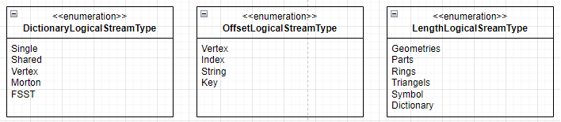
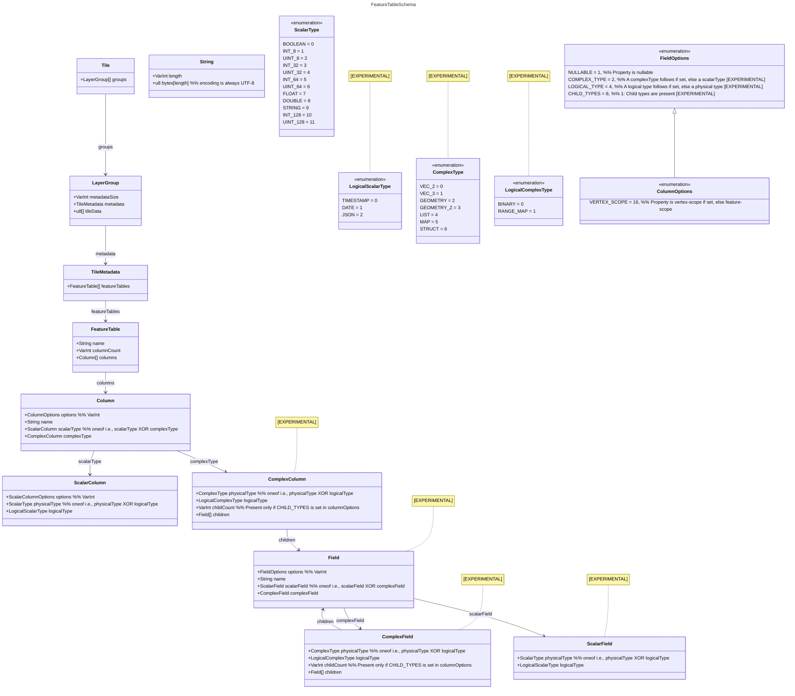
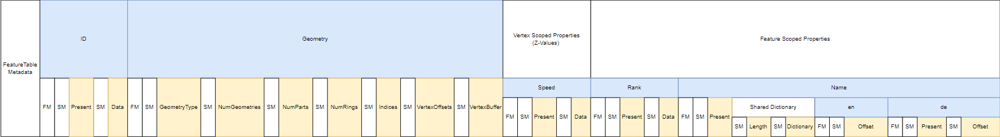
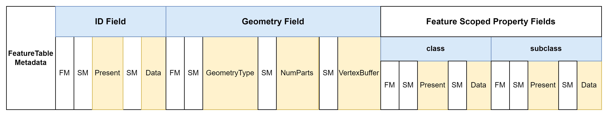
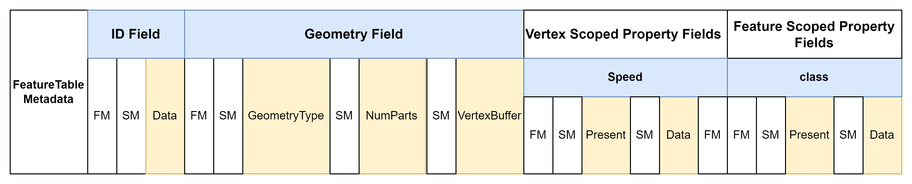

<h1>MapLibre Tile Specification</h1>

--8<-- "live-spec-note"

[TOC]

---

# Basics

An MLT (MapLibre Tile) contains information about a specific geographic region, known as a tile.
Each tile is a collection of `FeatureTables`, which are equivalent to `Layers` in the [MVT specification](https://github.com/mapbox/vector-tile-spec).

A `FeatureTable` contains thematically grouped vector data, known as `Features`.
Features within a single FeatureTable share a common set of attribute columns (properties) and typically share the same geometry type (though this is not strictly required).

Each `FeatureTable` is preceded by a `FeatureTableMetadata` that describes `FeatureTable`'s structure.

The visual appearance of a tile is usually defined by a [MapLibre Style](https://maplibre.org/maplibre-style-spec/), which specifies how features are rendered.

Each feature must have
- a `geometry` column (type based on the OGC's Simple Feature Access Model (SFA), excluding support for `GeometryCollection` types)
- an optional `id` column
- optional property columns

While geometries are not restricted to a single type, using one type per table is recommended for efficiency.
As in MVT, geometry coordinates are encoded as integers within vector tile grid coordinates.

!!! NOTE
    The terms `column`, `field`, and `property` are used interchangeably in this document.

# Tile Layout

A `FeatureTable` in the MLT specification uses a tabular, column-oriented layout.
It employs various lightweight compression schemes to encode column values efficiently.

A FeatureTable consists of a mandatory `geometry` column, an optional `id` column, and optional property columns.
The absence of a single header at the beginning of the tile allows `FeatureTable`s to be constructed independently, and even concatenated on the fly.

A logical column is separated into several physical `streams` (sub-columns), inspired by the ORC file format.
These streams are stored contiguously.
A stream is a sequence of values of a known length in a continuous memory chunk, all sharing the same type.
Streams include additional metadata, such as their size and encoding type.

For example, a nullable string property column might have:
- A **`present` stream** (a bit flag indicating the presence of a value).
- A **`length` stream** (describing the number of characters for each string).
- A **`data` stream** (containing the actual UTF-8 encoded string values).

MLT defines the following stream types:

- **Present**:
  Enables efficient encoding of sparse columns by indicating value presence via a bit flag.
  This stream can be omitted if the column is not nullable (as declared in the `FieldMetadata`).
- **Data**:
  Stores the actual column data (e.g., `boolean`, `int`, `float`, or `string` values for feature properties, dictionary-encoded values, or geometry coordinates).
  For fixed-size data types (`boolean`, `int`, `float`), this is the only required stream besides the optional `present` stream.
- **Length**:
  Specifies the number of elements for variable-sized data types like strings or lists.
- **Offset**:
  Stores offsets into a data stream when using dictionary encoding (e.g., for strings or vertices).

These physical streams are further categorized into logical streams that define how to interpret the data:

## Metadata

### Tileset Metadata 

!!! NOTE
    Tileset metadata was initially implemented as a size reduction experiment.
    This feature is not currently supported.

Global metadata for the entire tileset is stored separately in a [JSON file](assets/spec/mlt_tileset_metadata.json).

This tileset metadata provides information for the full tileset and is the equivalent of the TileJSON spec commonly used with MVT and other tile types.
By defining this information once per tileset, we avoid redundant metadata in each tile, saving significant space, especially for small tiles.

### Tile Metadata
There is no global tile header.  Each `FeatureTable` has its own metadata.

### FeatureTable Metadata

Each `FeatureTable` is preceded by a `FeatureTableMetadata` section describing it.

!!! CAUTION
    This is not clear, and possibly incorrect.
    Why any number?
    Should the size of the upcoming metadata and table be part of that structure?

A FeatureTable consists of any number of the following sequences:
- The size of the upcoming `FeatureTableMetadata` (varint-encoded).
- The size of the upcoming `FeatureTable` (varint-encoded).
- One `FeatureTableMetadata` section.
- One `FeatureTable` section.

This structure allows a tile to be built by simply concatenating separate results.
The `FeatureTableMetadata` is described in detail below.

Within a `FeatureTable`, additional metadata describes the structure of each part:

- **FieldMetadata**:
  Contains information about a field (column), including the number of streams it comprises and its vector type for efficient decoding into the in-memory format.
  Every field section is preceded by a `FieldMetadata` section.
- **StreamMetadata**:
  Contains information about a stream, such as the encoding scheme used and the number of values.
  Every stream section is preceded by a `StreamMetadata` section.

Since every `Field` has a `FieldMetadata` section, even for fields absent in a specific tile, no `id` is needed.
A field's absence is indicated by a zero value for its number of streams.
All integers in metadata sections are `Varint`-encoded (for u32) or bit-packed (for u8).

## Type System

The MLT type system distinguishes between physical and logical types.
Physical types define the data layout in storage, while logical types add semantic meaning.
This separation simplifies encoder and decoder implementation and allows encoding schemes to be reused.

### Physical Types

Physical types define the data layout in storage.
Both scalar and complex types can be categorized as fixed-size or variable-size binaries.
Variable-size binaries require an additional length stream to specify the size of each element.
Fixed-size binaries have a consistent bit (boolean) or byte width and thus require no length stream.

**Scalar Types**

Each scalar type uses a specific encoding scheme for its data stream.

| Data Type                                   | Logical Types                   | Description                          | Layout        |
| ------------------------------------------- | ------------------------------- | ------------------------------------ | ------------- |
| Boolean                                     |                                 |                                      | Fixed-Size    |
| Int8, UInt8, Int32, UInt32, Int64, UInt64  | Date (int32), Timestamp (int64) |                                      | Fixed-Size    |
| Float, Double                               |                                 |                                      | Fixed-Size    |
| String                                      | JSON                            | UTF-8 encoded sequence of characters | Variable-Size |

**Complex Types **

Complex types are composed of scalar types.

| Data Type | Logical Types        | Description                                        | Layout        |
| --------- | -------------------- | -------------------------------------------------- | ------------- |
| List      | Binary (List<UInt8>) |                                                    | Variable-Size |
| Map       | Map<vec2d, T>        | Additional key stream -> length, key, data streams | Variable-Size |
| Struct    |                      |                                                    |               |
| Vec2<T>, Vec3<T> | Geometry, GeometryZ |                                                    | Fixed-Size    |

### Logical Types 

!!! CAUTION
    Original text had `encodings can be reused` text which is unclear.
    What is "encodings" in this context?

Logical types add semantics on top of physical types, enabling code reuse and simplifying encoder/decoder implementation.

| Logical Type | Physical Type             | Description                                |
| ------------ | ------------------------- | ------------------------------------------ |
| Date         | Int32                     | Number of days since Unix epoch            |
| Timestamp    | Int64                     | Number of milliseconds since Unix epoch    |
| RangeMap     | Map<vec2<Double>, T>      | For storing linear referencing information |
| Binary       | List<UInt8>               |                                            |
| JSON         | String                    |                                            |
| Geometry     | vec2<Int32>               |                                            |
| GeometryZ    | vec3<Int32>               |                                            |

### Nested Fields Encoding

For nested properties (e.g., structs, lists), a [present/length](https://arxiv.org/pdf/2304.05028.pdf) pair encoding is chosen over the Dremel encoding for its simpler implementation and faster decoding into the in-memory format.

Every nullable field has an additional `present` stream.
Every collection type field (e.g., a list) has an additional `length` stream specifying its length.
As in ORC, nested fields are flattened based on a pre-order traversal.

Nested fields can also use shared dictionary encoding to share a common dictionary (e.g., for localized `name:*` columns in an OSM dataset).
Fields using a shared dictionary must be grouped sequentially in the file and prefixed by the dictionary.

### RangeMap 

`RangeMaps` efficiently encode linear referencing information, as used in [Overture Maps](https://docs.overturemaps.org/overview/feature-model/scoping-rules#geometric-scoping-linear-referencing).
`RangeSets` store range values and data values in two separate streams. The min and max values for the ranges are stored as interleaved double values in a separate range stream.

## Encoding Schemes

MLT uses various lightweight compression schemes for space-efficient storage and fast decoding.
Encodings can be recursively cascaded (hybrid encodings) to a certain degree.
For example, integer columns resulting from dictionary encoding can be further compressed using integer encoding schemes.

The following encoding pool was selected based on analysis of compression ratio and decoding speed on test datasets like OpenMapTiles and Bing Maps tilesets.

| Data Type | Logical Level Technique      | Physical Level Technique            | Description |
| --------- | ---------------------------- | ----------------------------------- | ----------- |
| Boolean   | [Boolean RLE](https://orc.apache.org/specification/ORCv1/#boolean-run-length-encoding) | | |
| Integer   | Plain, RLE, Delta, Delta-RLE | [SIMD-FastPFOR](https://arxiv.org/pdf/1209.2137.pdf), [Varint](https://protobuf.dev/programming-guides/encoding/#varints) | |
| Float     | Plain, RLE, Dictionary, [ALP](https://dl.acm.org/doi/pdf/10.1145/3626717) | | |
| String    | Plain, Dictionary, [FSST](https://www.vldb.org/pvldb/vol13/p2649-boncz.pdf) Dictionary | | |
| Geometry  | Plain, Dictionary, Morton-Dictionary | | |

!!! NOTE
    `ALP`, `FSST`, and `FastPFOR` encodings are .

SIMD-FastPFOR is generally preferred over Varint encoding due to its smaller output and faster decoding speed.
Varint encoding is included mainly for compatibility and simplicity, and it can be more efficient when combined with heavyweight compression like GZip.

A brute-force search for the best encoding scheme is too costly.
Instead, we recommend the selection strategy from the [BTRBlocks](https://www.cs.cit.tum.de/fileadmin/w00cfj/dis/papers/btrblocks.pdf) paper:

- Calculate data metrics to exclude unsuitable encodings early (e.g., exclude RLE if the average run length is less than 2).
- Use a sampling-based algorithm: randomly select parts of the data totaling ~1% of the full dataset and apply the candidate encodings from step 1.
  Choose the scheme that produces the smallest output.

## FeatureTable Layout

### ID Column

An `id` column is not mandatory.
If included, it should be a u64 or narrower integer type (u32 if possible) for MVT compatibility.
A narrower type enables the use of efficient encodings like FastPfor128.

### Geometry Column

The geometry column uses a Structure of Arrays (SoA) layout (data-oriented design).
The `x`, `y`, and optional `z` coordinates are stored interleaved in a `VertexBuffer` for efficient CPU processing and direct copying to GPU buffers.
If the `z` coordinate is not needed for rendering, it can be stored separately as an `M-value` (see vertex-scoped properties).

The geometry information is separated into different streams, partly inspired by the [geoarrow](https://github.com/geoarrow/geoarrow) specification.
This separation enables better compression optimization and faster processing.
Pre-tessellated polygon meshes can also be stored directly to avoid runtime triangulation.

A geometry column can consist of the following streams:

| Stream Name    | Data Type | Encoding           | Mandatory |
| -------------- | :-------: | ------------------ | :-------: |
| GeometryType  |   Byte    | Integer |     ✓     |
| NumGeometries |   UInt32  | Integer |           |
| NumParts      |   UInt32  | Integer |           |
| NumRings      |   UInt32  | Integer |           |
| NumTriangles  |   UInt32  | Integer |           |
| IndexBuffer   |   UInt32  | Integer |           |
| VertexOffsets |   UInt32  | Integer |           |
| VertexBuffer  | Int32 or Vertex[] | Plain, Dictionary, Morton |     ✓     |

Depending on the geometry type, the following streams are used in addition to `GeometryType`:
- **Point**: VertexBuffer
- **LineString**: NumParts, VertexBuffer
- **Polygon**: NumParts (Polygon), NumRings (LinearRing), VertexBuffer
- **MultiPoint**: NumGeometries, VertexBuffer
- **MultiLineString**: NumGeometries, NumParts (LineString), VertexBuffer
- **MultiPolygon**: NumGeometries, NumParts (Polygon), NumRings (LinearRing), VertexBuffer

An additional `VertexOffsets` stream is present when using Dictionary or Morton-Dictionary encoding.
If geometries (mainly polygons) are pre-tessellated for direct GPU use, `NumTriangles` and `IndexBuffer` streams must be provided.

### Property Columns

Feature properties are divided into `feature-scoped` and `vertex-scoped` properties.
- **Feature-scoped**: One value per feature.
- **Vertex-scoped**: One value per vertex in the VertexBuffer per feature (modeling M-coordinates from GIS).

!!! TODO
    Would it make sense to place vertex-scoped properties AFTER feature scoped ones?
    I suspect some implementations may act of feature-scoped properties first, and possibly even ignore vertex-scoped, at least for now (esp since vertex-scoped ones are still experimental)

Vertex-scoped properties must be grouped together and placed before feature-scoped properties in the FeatureTable.
A property's scope is defined in the tileset metadata using the `ColumnScope` enum.

A property column can use any data type from the [type system](#type-system).

# Example Layouts

The following examples illustrate the layout of a `FeatureTable` in storage. The color scheme is:
- **Blue boxes**:
  Logical constructs, not persisted.
  Fields are reconstructed from streams based on TileSet metadata.
- **White boxes**:
  Metadata describing data structure (FeatureTable, Stream (SM), Feature (FM) metadata).
- **Yellow boxes**:
  Streams containing the actual data.

## Place Layer

Given a place [layer](assets/spec/place_feature.json) with the following JSON schema structure:

The resulting MLT tile layout for this layer, using a dictionary for the `geometry` and `name` columns, might look like this:

## LineString Geometry with Flat Properties

Encoding of a `FeatureTable` with an `id` field, a `LineString` geometry field, and the flat feature-scoped properties `class` and `subclass`:

## MultiPolygon with Flat Properties

Encoding of a `FeatureTable` with an `id` field, a `MultiPolygon` geometry field, and flat feature-scoped property fields.
A `VertexOffsets` stream is present due to vertex dictionary encoding:

## Vertex-Scoped and Feature-Scoped Properties

Example layout encoding vertex-scoped and feature-scoped properties.
All vertex-scoped properties are grouped together and placed before feature-scoped properties.
The `id` column is not nullable, so its present stream is omitted.

# Sorting

Choosing the right column to sort features by can significantly reduce the size of the `FeatureTable`.
Sorting is crucial for leveraging the columnar layout fully.
Exhaustively testing every possible sorting order for every column in every layer is computationally expensive.
See recommended heuristic in the [encoding schemes](#encoding-schemes).

# Encodings

!!! TODO
    inline encodings here

Encoding details are specified in [a separate document](encodings.md).

# In-Memory Format

!!! NOTE
    The following is a high-level overview; the in-memory format will be explained in more detail later.

The record-oriented, array-of-structures in-memory model used by libraries processing Mapbox Vector Tiles incurs considerable overhead.
This includes creating many small objects (increasing memory allocation load) and placing additional strain on garbage collectors in browsers.

MLT uses a columnar memory layout (data-oriented design) for its in-memory format to overcome these issues.
This approach improves cache utilization for subsequent data access and enables the use of fast SIMD instructions.
The MLT in-memory format incorporates ideas from analytical in-memory formats like Apache Arrow, Velox, and the DuckDB execution format, tailored for visualization use cases.
It is also designed for future parallel processing on the GPU within compute shaders.

The main design goals for the MLT in-memory format are:
- Define a platform-agnostic representation to avoid expensive materialization costs, especially for strings.
- Maximize CPU throughput by optimizing memory layout for cache locality and SIMD instructions.
- Allow random (preferably constant-time) access to all data for parallel processing on GPUs (compute shaders).
- Provide compressed data structures that can be processed directly without full decoding.
- Provide tile geometries in a representation that can be loaded into GPU buffers with minimal additional processing.

Data is stored in contiguous memory buffers called **vectors**, accompanied by metadata and an optional null bitmap.
The storage format includes a `VectorType` field in the metadata to instruct the decoder which vector type to use for a specific field.
An auxiliary offset buffer enables random access to variable-sized data types like strings or lists.

The MLT in-memory format supports the following vector types:

- [Flat Vectors](https://duckdb.org/internals/vector.html#flat-vectors)
- [Constant Vectors](https://duckdb.org/internals/vector.html#constant-vectors)
- [Sequence Vectors](https://duckdb.org/internals/vector.html#sequence-vectors)
- [Dictionary Vectors](https://duckdb.org/internals/vector.html#dictionary-vectors)
- FSST Dictionary Vectors 
- Shared Dictionary Vectors 
- [Run-End Encoded (REE) Vectors](https://arrow.apache.org/docs/format/Columnar.html#run-end-encoded-layout)

!!! NOTE
    Further evaluation is needed to determine if [recent research](https://arxiv.org/pdf/2306.15374.pdf) can enable random access on delta-encoded values.

Using a compressed vector where possible makes the conversion from storage to in-memory format essentially a zero-copy operation.

Following Apache Arrow's approach and the [Intel performance guide](https://www.intel.com/content/www/us/en/developer/topic-technology/data-center/overview.html), decoders should allocate memory on addresses aligned to a 64-byte multiple (where possible).
