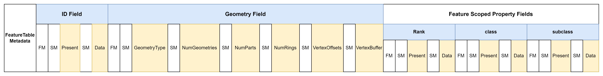

# MapLibre Tile Specification

--8<-- "live-spec-note"

## 1. Storage Format

### 1.1 Basics

MLT (MapLibre Tile) contains information about a specific geographic region - a tile. Each tile is a collection of `FeatureTables`, which are equivalent to Layers in the [MVT specification](https://github.com/mapbox/vector-tile-spec).

Each `FeatureTable` contains thematically grouped vector data, known as Features. Features in one FeatureTable share a common set of attribute columns (properties) and usually share the same geometry type (but not required to).

The visual appearance of a tile on a map is usually controlled by [MapLibre Style Specification](https://maplibre.org/maplibre-style-spec/), which specifies how the features in the FeatureTables are rendered.

Each feature must have a `geometry` column, an optional `id` column, and optional property columns. The geometry column type is based on the OGC's Simple Feature Access Model (SFA) without the support for GeometryCollection types.

The geometries are not restricted to one geometry type, but this is recommended for reasons of efficiency.
As in MVT, the geometry coordinates are encoded as integers in a vector tile grid coordinates.

> [!NOTE]
> "column", "field", and "property" are used interchangeably in this document.

### 1.2 File Layout

A FeatureTable in the MLT specification is based on a tabular, column-oriented layout.
It uses different lightweight compression schemes to efficiently encode the values of the columns.
A FeatureTable consists of a optional `id` column, a mandatory `geometry` column and optional property columns.
Because there is no tile header, `FeatureTable`s can be concatenated on the fly.

A logical column is separated into several physical `streams` (sub-columns) inspired by the ORC file format which are stored next to each other. A stream is a sequence of values of a known length in a continuous chunk of memory, all having the same type. A stream has some additional metadata such as the size of the stream and the encoding type.
For example, a nullable string property column can have a `present stream`, which indicates the presence of a value,
a `length` stream, which describes the number of characters of every string, and a `data stream`, with the actual
UTF-8 encoded string values.

MLT distinguishes between the following type of streams:

- **present**:
  Is used for a efficient encoding of sparse columns since it indicates the presence of a value base on a bit flag.
  This stream can be omitted if the column is not declared as nullable in the `FieldMetadata`.
- **data**:
  Stores the actual data of a column such as `boolean`, `int`, `float`, or `string` values of the feature properties.
  Dictionary-encoded values, string values, or the coordinate values of a geometry column are stored in this type of stream.
  In addition to the optional present stream, this is the only used stream type for fixed-sized data types such as `boolean`, `int`, and `float`.
- **length**:
  Specifies the number of elements for variable-sized data types such as strings or list.
- **offset**:
  Stores the offsets into a data stream when dictionary encoding is used such as for strings or vertices.

This physical streams are further divided into logical streams that add additional semantics of how to interpret the data:

#### 1.2.1 Metadata

##### Tileset Metadata

Global metadata for the tileset is stored separately, in [JSON format](assets/spec/mlt_tileset_metadata.json).

The tileset metadata defines information for the full tileset is the equivalent to the TileJSON spec, which is commonly used in combination with MVT.

By specifying the information once per tileset, the definition of redundant (shared) metadata per tile will be avoided,
which can take some relevant space of the overall size on small tiles.

##### Tile Metadata

Each `FeatureTable` is preceded by a `FeatureTableMetadata` describing it.

A tile consists of any number of:

- The size of the `FeatureTableMetadata` to follow, varint-encoded
- The size of the `FeatureTable` to follow, varint-encoded
- One `FeatureTableMetadata`
- One `FeatureTable`

The `FeatureTableMetadata` is described in detail below.

Each `FeatureTableMetadata`/`FeatureTable` pair may contain one or more layers.  This allows the tile to be built by simple concatenation of separate results.

Within a `FeatureTable`, additional metadata describes the structure of each part:

- **FieldMetadata**: contains information about the number of streams the field is divided and the vector type for efficient decoding into the in-memory format. Every Field (column) section is preceded by a `FieldMetadata` section.
- **StreamMetdata**: contains information about the Stream such as the used encoding schemes
  and the number of values. Every Stream section is preceded by a `StreamMetadata` section.

Since for every `Field`, a `FieldMetadata` section has to be present, even for fields which are not included in one
specific tile, no `id` is needed.
The absence of an entire field in a tile can be identified by a zero value for the number of streams.
All integers in the metadata sections are `Varint`-encoded if u32 is used or bit-packed in case of an u8 data type.

#### 1.2.2 Type system

The types system of MLT is divided into physical and logical types.
The physical types define the layout of the data in the storage format, while the logical types give additional semantics to the physical types.
Based on this separation, the encoding and decoding of the data can be simplified.
This reduces the complexity for implementing encoder and decoder as well allow the encodings to be reused.

##### 1.2.2.1 Physical Types

The physical types define the layout of the data in the storage format.
Both scalar and complex types can be divided into fixed-size binaries and variable-size binaries.
Variable-size binaries have an additional length stream which specifies the size of each element.
All fixed-size binaries have the same bit (boolean) or byte width and therefore no additional length stream is used.

**Scalar Types**

Each scalar type has a specific encoding scheme which can be applied to the data stream.

| DataType                                   | Logical Types                   | Description                          | Layout        |
|--------------------------------------------|---------------------------------|--------------------------------------|---------------|
| Boolean                                    |                                 |                                      | Fixed-Size    |
| Int8, UInt8, Int32, UInt32, Int64 , UInt64 | Date (int32), Timestamp (int64) |                                      | Fixed-Size    |
| Float, Double                              |                                 |                                      | Fixed-Size    |
| String                                     | JSON                            | UTF-8 encoded sequence of characters | Variable-Size |

<b>Complex Types </b>

Complex types are composed of scalar types.

| DataType         | Logical Types           | Description                                        | Layout        |
|------------------|-------------------------|----------------------------------------------------|---------------|
| List             | Binary (List<UInt8>)    |                                                    | Variable-Size |
| Map              | Map<vec2d, T>           | additional key stream -> length, key, data streams | Variable-Size |
| Struct           |                         |                                                    |               |
| Vec2<T>, Vec3<T> | Geometry, GeometryZ     |                                                    | Fixed-Size    |

##### 1.2.2.2 Logical Types 

Add additional semantics on top of the physical types.
This had the advantage that encodings can be reused and implementation of encoders and decoders can be simplified.

| Logical Type | Physical Type                  | Description                                |
|--------------|--------------------------------|--------------------------------------------|
| Date         | Int32                          | number of days since Unix epoch            |
| Timestamp    | Int64                          | number of milliseconds since Unix epoch    |
| RangeMap     | Map<vec2<Double>, T>           | for storing linear referencing information |
| Binary       | List<UInt8>                    |                                            |
| JSON         | String                         |                                            |
| Geometry     | vec2<Int32>                    |                                            |
| GeometryZ    | vec3<Int32>                    |                                            |

##### Nested Fields Encoding

For nested properties such as structs and lists, a [present/length](https://arxiv.org/pdf/2304.05028.pdf) pair encoding
is selected over the widely used Dremel encoding, since it is simpler to implement and faster to decode into the in-memory format.
Every nullable field, has an additional `present` stream.
Every field that is a collection type, such as a list, has an additional `length` stream that specifies the length of the field.
Like in ORC, the nested fields are flattened based on a pre-order traversal.
In addition, nested fields can use a shared dictionary encoding, to share a common dictionary between the fields.
This can be applied, for example, on localized values of the name:* columns of an OSM dataset that can be identical across fields.
If a shared dictionary encoding is used for nested fields, all fields that use the shared dictionary
must be grouped sequentially in the file and prefixed with the dictionary.

##### RangeMap 

RangeMaps are an efficient way to encode linear referencing information, as used for example in [Overture Maps](https://docs.overturemaps.org/overview/feature-model/scoping-rules#geometric-scoping-linear-referencing).
RangesSets store the range values and data values in two separate streams.
The min and max values for the ranges are stored as interleaved double values in a separate range stream.

#### 1.2.3 Encoding Schemes

MLT uses different lightweight compression schemes for the space efficient storage and fast decoding of the data types.
To further reduce the size of a column the encodings can be recursively cascaded (hybrid encodings) up to a certain level.
For example the resulting integer columns of a dictionary encoding can be further compressed based on one of the Integer encoding schemes.
The following encoding pool for specific data types was selected based on the analytics on the efficiency
in terms of the compression ratio and decoding speed on test datasets such as the OpenMapTiles schema and Bing Maps based tilesets.

| DataType | Logical  Level Technique | Physical Level Technique | Description |
|--|--|--|--|
| Boolean  | [Boolean RLE](https://orc.apache.org/specification/ORCv1/#boolean-run-length-encoding) | | |
| Integer  | Plain, RLE, Delta, Delta-RLE | [SIMD-FastPFOR](https://arxiv.org/pdf/1209.2137.pdf), [Varint](https://protobuf.dev/programming-guides/encoding/#varints) | |
| Float    | Plain, RLE, Dictionary, [ALP](https://dl.acm.org/doi/pdf/10.1145/3626717) | | |
| String   | Plain, Dictionary, [FSST](https://www.vldb.org/pvldb/vol13/p2649-boncz.pdf) Dictionary | | |
| Geometry | Plain, Dictionary, Morton-Dictionary | | |

> [!NOTE]
> `ALP`, `FSST`, and `FastPFOR` encodings are .

Since SIMD-FastPFOR generally produces smaller data streams and is faster to decode, it should be preferred over Varint encoding.
Varint encoding is mainly added to the encoding pool for compatibility reasons and it's simpler implementation compared to SIMD-FastPFOR.
Varint encoding also can be more efficient when used in combination with heavyweight compression schemes like GZip.

To find the best coding schemes for a specific data type from the coding pool, using a brute force approach by testing all available schemes
with respect to the resulting column size would be too costly. The recommended approach improves the selection time by using
the selection strategy described in the [BTRBlocks](https://www.cs.cit.tum.de/fileadmin/w00cfj/dis/papers/btrblocks.pdf) paper:

- First, calculation of data metrics to early exclude encodings. For example if the average run length is less than 2,
  RLE encoding is not a candidate for the encodings pool
- Second, use a sampling-based algorithm for choosing the best compression scheme out of the pool by taking randomly parts
  of the data with a total size of 1% of the full data and apply the encoding schemes selected in step 1. Apply the encoding scheme
  on the data which produces the smallest output

#### 1.2.4 FeatureTable Layout

##### ID Column

No `id` column is mandatory.  If an identifier column is included, it should be u64 or a narrower integer type for compatibility with MVT.
Narrow the column to u32, if possible, to enable the use of FastPfor128 encoding.

##### Geometry Column

The main idea is to use a structure of arrays (data-oriented design) layout for the geometries.
The `x`, `y`, and optional `z` coordinates are stored interleaved in a `VertexBuffer` so that they can be efficiently processed
on the CPU or even directly copied to GPU buffers. If the `z` coordinate is not relevant for rendering, it can be stored separately as
an m-coordinate (see vertex-scoped properties).

The information about the geometry of the features is separated in different streams and is partly inspired
by the [geoarrow](https://github.com/geoarrow/geoarrow) specification.
Using separate streams for describing the geometry of a feature enables a better optimization of the compression
and faster processing. In addition, pre-tessellated polygon meshes can be stored directly in the file to avoid the time-consuming triangulation step.

A geometry column can consist of the following streams:

| Stream name   |     Data type     |                encoding                | mandatory |
|---------------|:-----------------:|:--------------------------------------:|:---------:|
| GeometryType  |       Byte        |     see availabe integer encodings     | &#10003;  |
| NumGeometries |      UInt32       |     see availabe integer encodings     | &#10007;  |
| NumParts      |      UInt32       |     see availabe integer encodings     | &#10007;  |
| NumRings      |      UInt32       |     see availabe integer encodings     | &#10007;  |
| NumTriangles  |      UInt32       |     see availabe integer encodings     | &#10007;  |
| IndexBuffer   |      UInt32       |     see availabe integer encodings     | &#10007;  |
| VertexOffsets |      UInt32       |     see availabe integer encodings     | &#10007;  |
| VertexBuffer  | Int32 or Vertex[] | Plain, Dictionary or Morton Dictionary | &#10003;  |

Depending on the type of the geometry, the geometry column can have the following streams in addition to the `GeometryType` stream:

- Point: VertexBuffer
- LineString: NumParts, VertexBuffer
- Polygon: NumParts (Polygon), NumRings (LinearRing), VertexBuffer
- MultiPoint: NumGeometries, VertexBuffer
- MultiLineString: NumGeometries, NumParts (LineString), VertexBuffer
- MultiPolygon: NumGeometries, NumParts (Polygon), NumRings (LinearRing), VertexBuffer

In addition, the geometry column can consist of an additional `VertexOffsets` stream when a Dictionary or Morton-Dictionary
encoding is applied. If the geometries (mainly polygons) are stored in a tessellated/triangulated form for direct copying to a GPU Buffer,
an additional `NumTriangles` and `IndexBuffer` must be provided.

##### Property Columns

The properties of a feature are divided into `feature-scoped` and `vertex-scoped` properties.
The values of feature-scoped properties are related to a specific Feature, which means there is one value in
a property column per feature.

The values of a vertex-scoped properties are related to each vertex, which means there is one value in a property column
per vertex in the VertexBuffer. This allows to model what is known as M-coordinates in GIS applications.
Vertex-scoped properties have to be grouped together and are placed before the feature-scoped properties in the FeatureTable.
The scope of a property column is specified in the tileset metadata document based on the `ColumnScope` enum.

A property column can have one of the above listed [data types](#122-type-system).

### 1.3 Example Layouts

In the following, examples for the layout of a `FeatureTable` in storage are illustrated.
The following colors are used to highlight different kind of data:

- blue boxes: columns that have only logical character and are not persisted.
  Based on the TileSet metadata the fields can be reconstructed from the streams.
- white boxes: metadata which describe the structure of the data. The metadata is divided into
  FeatureTable, Stream (SM) and Feature (FM) metadata
- yellow boxes: streams which contains the actual data

#### 1.3.1 Place layer

Given a place [layer](assets/spec/place_feature.json) with the following structure modeled as Json schema:

For the given schema the place layer can have the following layout in a MLT tile
when a dictionary for the `geometry` and `name` column is used.

#### 1.3.2 LineString geometry with flat properties

Encoding of a `FeatureTable` with an `id` field, a `LineString` geometry field and the flat feature scoped properties class and subclass:

#### 1.3.3 MultiPolygon with flat properties

Encoding of a `FeatureTable` with a `id` field, `MultiPolygon` geometry field and flat feature scoped property fields.
Because vertex dictionary encoding is used a `VertexOffsets` stream is present:

#### 1.3.4 Vertex-scoped and feature-scoped properties

Example layout for encoding of vertex-scoped and feature scoped properties.
All vertex-scoped properties have to be grouped together and placed before the feature-scoped properties
in the file. Since the `id` colum in this example is not `nullable`, the present stream can be omitted.

### Sorting

Choosing the right column for sorting the features can have significant impact on the size
of the `FeatureTable`. To take full advantage of the columnar layout, sorting is crucial.
To test every layer for every possible sorting order of every column is too costly.

### 1.4 Encodings

The details of encodings are specified in [a separate document](encodings.md).

## 2. In-Memory Format

> [!NOTE]
> The in-memory format will be explained in more detail; the following is only a rough overview:

The record-oriented, in-memory model (array of structures approach) used by the libraries that process
the Mapbox Vector Tiles leads to a considerable overhead, such as the creation of a large number of small objects (per-object memory allocation),
that place an additional load on the garbage collector in the browser.

By using a columnar memory layout (data-oriented design), for the MLT in-memory format, we can overcome these issues and
additionally take advantage of an improved cache utilization for subsequent access and fast SIMD instructions for the processing of the data.
The MLT in-memory format incorporates and extends the ideas from the analytical in-memory formats Apache Arrow, Velox, and the DuckDB execution
format and is tailored for the visualization use case. To be future-proof it is important that the file can be parallel processed on the GPU for the
usage within a GPU compute shader.

The main design goals of the MLT in-memory format are:

- Define a platform-agnostic representation to avoid the expensive materialization costs in particular for strings
- Enable advanced CPU throughput by optimizing the memory layout for cache locality and SIMD instructions
- Allow random (mainly constant time) access to all data, so it can also be parallel processed on the GPU (compute shader)
- Provide compressed data structure which can be directly processed without decoding
- Provide the geometries of a tile in a representation that can be (directly) loaded into GPU buffers with little or no additional processing

The data are stored in continuous memory buffers, referred to as vectors, with additional metadata and an optional nullability bitmap
for representing null values. The storage format contains a `VectorType` field in the metadata that tells the decoder
which vector type to use for a specific filed. In order to enable random access to variable-sized data types such as strings or lists,
an auxiliary buffer containing offset values will be utilized.

The MLT in-memory format supports the following vectors:

- [Flat Vectors](https://duckdb.org/internals/vector.html#flat-vectors)
- [Constant Vectors](https://duckdb.org/internals/vector.html#constant-vectors)
- [Sequence Vectors](https://duckdb.org/internals/vector.html#sequence-vectors)
- [Dictionary Vectors](https://duckdb.org/internals/vector.html#dictionary-vectors)
- FSST Dictionary Vectors 
- Shared Dictionary Vectors 
- [Run-End Encoded (REE) Vectors](https://arrow.apache.org/docs/format/Columnar.html#run-end-encoded-layout)

> [!NOTE]
> Further evaluation is needed to determine if the [latest research findings](https://arxiv.org/pdf/2306.15374.pdf)
> can be used to enable random access on delta encoded values as well

In case a compressed vector can be used, this has the additional advantage that the conversion from the storage
into in-memory format is basically a zero-copy operation.

Following Apache Arrow's approach based on the [Intel performance guide](https://www.intel.com/content/www/us/en/developer/topic-technology/data-center/overview.html),
we recommend that decoders should allocate memory on aligned addresses with a multiple of 64-bytes (if possible).
