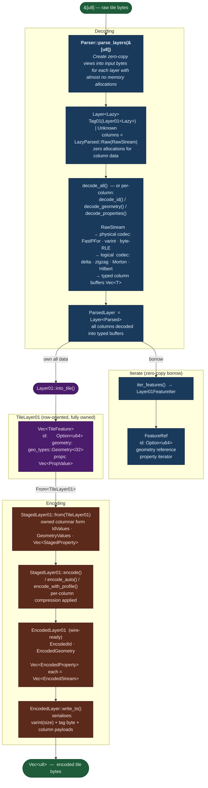

# `MapLibre Tile` (MLT) Rust library

<picture>
  <source media="(prefers-color-scheme: dark)" srcset="https://maplibre.org/img/maplibre-logos/maplibre-logo-for-dark-bg.svg">
  <source media="(prefers-color-scheme: light)" srcset="https://maplibre.org/img/maplibre-logos/maplibre-logo-for-light-bg.svg">
  
</picture>

The `MapLibre Tile` specification is mainly inspired by the [Mapbox Vector Tile (MVT)](https://github.com/mapbox/vector-tile-spec) specification,
but has been redesigned from the ground up to address the challenges of rapidly growing geospatial data volumes
and complex next-generation geospatial source formats as well as to leverage the capabilities of modern hardware and APIs.
MLT is specifically designed for modern and next generation graphics APIs to enable high-performance processing and rendering of
large (planet-scale) 2D and 2.5 basemaps.

In particular, MLT offers the following features:
- **Improved compression ratio**:
  Up to 6x on large encoded tiles, based on a column oriented layout with recursively applied (custom) lightweight encodings.
  This leads to reduced latency, storage, and egress costs and, in particular, improved cache utilization.
- **Better decoding performance**:
  Fast lightweight encodings which can be used in combination with SIMD/vectorization instructions.
- **Support for linear referencing and m-values**:
  To efficiently support the upcoming next generation source formats such as Overture Maps (`GeoParquet`).
- **Support for 3D coordinates**: i.e., elevation
- **Support for complex types**: including nested properties, lists, and maps
- **Improved processing performance**,
  based on storage and in-memory formats that are specifically designed for modern GL APIs, allowing for efficient processing on both CPU and GPU.
  The formats are designed to be loaded into GPU buffers with little or no additional processing.

📝 For a more in-depth exploration of MLT have a look at the [following slides](https://github.com/mactrem/presentations/blob/main/FOSS4G_2024_Europe/FOSS4G_2024_Europe.pdf), watch
[this talk](https://www.youtube.com/watch?v=YHcoAFcsES0) or read [this paper](https://dl.acm.org/doi/10.1145/3748636.3763208) by MLT inventor Markus Tremmel.

## Tile Structure

Top level structure of a tile is a sequence of layers, where each layer consists of `(size, tag, data)` tuples:
- `size: varint` - size of the data block in bytes, including the size of the `tag` field
- `tag: varint` - identifies the block type, e.g. `0x01 = feature table v1`, `0x02 = raster layer`, `0x03 = routing table`, etc. We only define `0x01` for now.
- `data: u8[]` - the actual data block of the specified size

This approach allows us to easily extend the format in the future by adding new block types, while keeping backward compatibility.
Parsers can skip unknown block types by reading the `size` and moving forward accordingly.
For now, we only define `0x01` for vector layers, and possibly a few more if needed.

Note the ordering:
`tag` is after the `size` because it is possible to treat it as a single byte for now, until the parser supports more than 127 types.
This allows the parser to efficiently skip unknown types without doing more expensive varint parsing.

## Layer 0x01 - MVT compatibility

Structure of the data if the `tag` above is 0x01.
We should focus this tag on MVT compatibility, offering exactly what we had in MVT, but allowing for a clearly defined set of encodings and other optimizations like tessellation.
No new data formats (per vertex data, nested data, 3d geometries, etc.).
No extendable encodings - once finalized, 0x01 will only allow what has been specified.
This will ensure that if a decoder declares "0x01" support, it will parse every specification-compliant 0x01 layer.
For any new features and encodings we will simply use a new tag ID, likely reusing most of the existing encoding/decoding code.

- `name: string` - Name of the layer
- `columnCount: varint` - Number of columns in the layer
- each column is defined as:
    - `columnType: varint` - same idea as `tag` above, e.g. `1 = id`, `2 = geometry`, `3 = int property`, etc.
    - TODO...

See [`CONTRIBUTING.md`](../CONTRIBUTING.md) for additional pipeline docs.

## Data Pipeline

The diagram below shows the full lifecycle of tile data — from raw bytes on the wire,
through lazy parsing and optional per-column decoding, to zero-copy iteration or
fully owned row-form access, and back to encoded bytes via the columnar encode pipeline.

**Key types and their roles:**

| Type | Role |
|------|------|
| `Layer<Lazy>` / `Layer01<Lazy>` | Parsed frame with column byte slices still unprocessed; zero allocation beyond the parse pass |
| `LazyParsed<Raw, Parsed>` | Type-state wrapper: `Raw(RawStream)` before decoding, `Parsed(T)` after, `ParsingFailed` on error |
| `ParsedLayer` = `Layer<Parsed>` | All columns decoded; borrow-based iteration via `iter_features()` |
| `TileLayer01` | Row-oriented, fully owned bridge between decode and encode |
| `StagedLayer01` | Owned columnar data ready for compression/encoding |
| `EncodedLayer01` | Wire-ready columnar data; written by `write_to()` with size + tag prefix |

## Tools

See the `mlt` tool for various ways to interact with the parser and decoder.
This includes a terminal-based visualizer for exploring MLT files.
